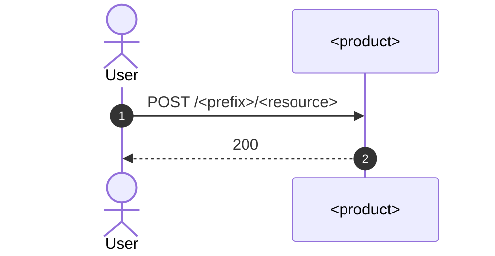

# VitePress Docs — Examples

Companion samples for the `vitepress-docs` instruction, which owns the rules these templates happen to satisfy. Substitute the resolved docs root for `<docs-root>` everywhere it appears.

## `package.json`

```json
{
  "name": "<product>-docs",
  "version": "0.1.0",
  "description": "Documentation for <Product>.",
  "private": true,
  "scripts": {
    "dev": "vitepress dev docs --host",
    "build": "vitepress build docs",
    "preview": "vitepress preview docs"
  },
  "author": "ALTEN",
  "license": "MIT",
  "repository": {
    "type": "git",
    "url": "git+https://github.com/<org>/<repo>.git",
    "directory": "<docs-root>"
  },
  "devDependencies": {
    "vitepress": "1.6.4"
  },
  "dependencies": {
    "mermaid": "11.17.0",
    "vitepress-plugin-mermaid": "2.0.17"
  }
}
```

## `docs/.vitepress/config.mjs`

```js
import { defineConfig } from 'vitepress'
import { withMermaid } from 'vitepress-plugin-mermaid'

const base = process.env.VITEPRESS_BASE || (process.env.NODE_ENV === 'production' ? '/' : '/docs/')

export default withMermaid(defineConfig({
  title: '<Product>',
  description: '<one-line product description from the code>',
  base,
  vite: {
    optimizeDeps: {
      include: ['fastdom', 'fastdom/extensions/fastdom-promised.js'],
    },
  },
  head: [
    ['link', { rel: 'icon', type: 'image/svg+xml', href: `${base}favicon.svg` }],
  ],
  themeConfig: {
    logo: '/logo.svg',
    siteTitle: false,
    sidebar: [
      {
        items: [
          { text: 'Overview', link: '/guide/overview' },
        ],
      },
      {
        text: 'Deployment',
        items: [
          { text: 'Docker Compose', link: '/guide/deployment' },
          { text: 'Environment Variables', link: '/guide/configuration' },
          { text: 'Integration', link: '/guide/integration' },
          { text: 'Troubleshooting', link: '/guide/troubleshooting' },
        ],
      },
      {
        text: 'API Reference',
        items: [
          { text: '<Resource>', link: '/guide/api-<resource>' },
        ],
      },
      {
        text: 'Architecture',
        items: [
          { text: 'Request Flow', link: '/guide/architecture' },
          { text: 'Frontend Integration', link: '/guide/frontend' },
        ],
      },
    ],
    socialLinks: [],
    footer: {
      message: 'Published and maintained by ALTEN',
    },
  },
}))
```

Nested sidebar group: `{ text: '…', collapsed: false, items: […] }`.

## `docs/index.md`

```md
---
layout: home

hero:
  name: <Product>
  text: <short category line>
  tagline: <one sentence of what it does>
  image:
    src: /logo.svg
    alt: <Product>
  actions:
    - theme: brand
      text: Get Started
      link: /guide/overview
    - theme: alt
      text: Enterprise Support
      link: https://www.alten.com/

features:
  - icon: 🔑
    title: <Capability>
    details: <what the code actually does>
---
```

## Guide page — overview

```md
# Overview

<Product> is **<what it is>**. <Where it sits in a stack>.

It is not <common confusion>.

<Product> handles:

- **<capability>** — <one line grounded in code>
```

Then `## Key Concepts` with a heading per domain object, and relative links to API pages (`./api-<resource>`).

## Guide page — API

```md
# <Resource>

<What this HTTP surface manages.>

## <Operation>

### API

\`\`\`
POST /<prefix>/<resource>
Content-Type: application/json

{
  "field": "value"
}
\`\`\`

**Response (200 OK)**

\`\`\`json
{
  "id": 1
}
\`\`\`

| Status | Meaning |
|---|---|
| `400` | Invalid body |
| `401` | Unauthenticated |
```

Mermaid sequence, for an operation that spans several services:

````md

````

## Guide page — configuration

```md
# Environment Variables

Variables for the `<service>` container. Required variables are validated at boot.

## Required

| Variable | Description |
|---|---|
| `EXAMPLE` | Taken from the service's env schema |

## Optional

| Variable | Default | Description |
|---|---|
| `PORT` | `3000` | Listen port |
```

## Guide page — architecture (ASCII pipeline)

```md
# Request Flow & Architecture

## Request Pipeline

\`\`\`
Client Request
    ↓
[middleware] - role
    ↓
[handler] - outcome
\`\`\`

## Key Middlewares

| Middleware | Role |
|---|---|
| `name` | What it does in this process |
```

## Dev `dockerfile` (docs root)

```dockerfile
ARG NODE_VERSION
FROM node:${NODE_VERSION}

LABEL org.opencontainers.image.description="<Product> documentation site (VitePress, development)"

ARG NODE_ENV
ENV NODE_ENV=${NODE_ENV}

RUN apk add --no-cache tzdata

ARG TZ
ENV TZ=${TZ}

ARG UID
ARG GID
RUN deluser --remove-home node && addgroup -S usergroup -g ${GID} && adduser -G usergroup -S user -u ${UID}
USER user

ARG NPMRC_PATH
RUN --mount=type=secret,id=npmrc,target=${NPMRC_PATH},required=true,uid=${UID}

WORKDIR /usr/src/app
COPY --chown=user:usergroup --chmod=640 package*.json ./

RUN npm i --loglevel=error --ignore-scripts --no-fund

CMD [ "node", "--run", "dev" ]
```

## Compose service (dev)

Place this in the stack compose file. Naming, `<<: *secretArgs`, and Traefik label conventions: see the Docker instruction.

```yaml
  website:
    build:
      context: ${PWD}/<docs-root>
      dockerfile: dockerfile
      <<: *secretArgs
      args:
        UID: ${UID}
        GID: ${GID}
        TZ: ${TZ}
        NODE_VERSION: ${NODE_VERSION}
        NODE_ENV: ${NODE_ENV}
    container_name: ${WEBSITE_HOST}
    hostname: ${WEBSITE_HOST}
    volumes:
      - ${PWD}/<docs-root>/package.json:/usr/src/app/package.json:ro
      - ${PWD}/<docs-root>/package-lock.json:/usr/src/app/package-lock.json
      - ${PWD}/<docs-root>/docs:/usr/src/app/docs
      - website_node_modules:/usr/src/app/node_modules
    command: sh -c "npm i --loglevel=error --ignore-scripts --no-fund && node --run dev"
    networks:
      - internal
    labels:
      - "traefik.enable=true"
      - "stack.name=${STACK_NAME}"
      - "traefik.http.routers.website.rule=PathPrefix(`/docs`)"
      - "traefik.http.routers.website.entrypoints=web"
      - "traefik.http.routers.website.service=website"
      - "traefik.http.services.website.loadbalancer.server.port=5173"
```

Declare `website_node_modules` under the compose `volumes:` key.

## GitHub Pages workflow

```yaml
name: Deploy Docs to GitHub Pages

on:
  push:
    branches: [main]
    paths:
      - '<docs-root>/**'
      - '.github/workflows/deploy-docs.yml'
  workflow_dispatch:

permissions:
  contents: read
  pages: write
  id-token: write

concurrency:
  group: pages
  cancel-in-progress: false

jobs:
  build:
    runs-on: ubuntu-latest
    steps:
      - name: Checkout
        uses: actions/checkout@v4

      - name: Setup Node
        uses: actions/setup-node@v4
        with:
          node-version: 22
          cache: npm
          cache-dependency-path: <docs-root>/package-lock.json

      - name: Install dependencies
        working-directory: <docs-root>
        run: npm ci

      - name: Build
        working-directory: <docs-root>
        run: npm run build

      - name: Setup Pages
        uses: actions/configure-pages@v5

      - name: Upload artifact
        uses: actions/upload-pages-artifact@v3
        with:
          path: <docs-root>/docs/.vitepress/dist

      - name: Deploy to GitHub Pages
        id: deployment
        uses: actions/deploy-pages@v4
```

## Gitignore entries

```
<docs-root>/node_modules/*
<docs-root>/docs/.vitepress/cache
<docs-root>/docs/.vitepress/dist
```

## Public assets

`docs/public/` holds `logo.svg`, `favicon.svg`, and — for a custom domain — a `CNAME` file containing the bare hostname:

```
docs.example.com
```
