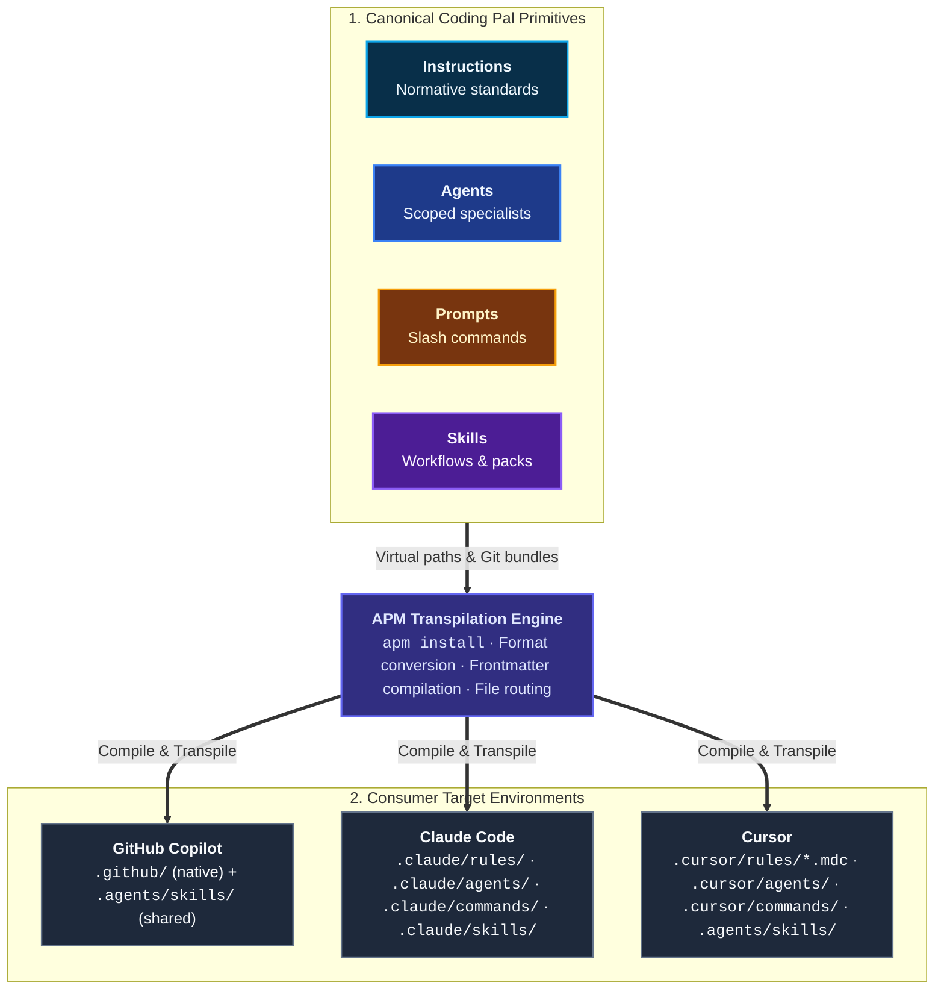

# Multi-Harness Distribution with APM

Coding Pal uses the [Agent Package Manager (APM)](https://microsoft.github.io/apm/) to compile, translate, and install persistent context primitives into multiple AI coding environments from a single source of truth.

## Target AI Harnesses

Coding Pal distributes its unified catalog across three primary AI coding harnesses using APM:



### Target Mapping Matrix

Dependencies remain identical across all AI harnesses — only `targets:` (and the `--target` CLI flag) changes:

| Harness | `targets:` in `apm.yml` | `apm install --target` |
|---|---|---|
| GitHub Copilot | `[copilot]` | `copilot` |
| Claude Code | `[claude]` | `claude` |
| Cursor | `[cursor]` | `cursor` |
| Copilot + Cursor | `[copilot, cursor]` | `copilot,cursor` |
| All three | `[copilot, claude, cursor]` | `copilot,claude,cursor` |

> [!WARNING]
> Claude Code and Cursor do **not** load Copilot’s `.github/instructions/` and `.github/agents/` paths. Always specify `claude`, `cursor`, or both in your `targets:` array so APM compiles and generates native configuration files for each environment.

---

## Where Files Land

Each AI environment expects persistent context in specific locations and formats. APM handles translation, frontmatter conversion, and deployment automatically:

| Primitive | GitHub Copilot (`copilot`) | Claude Code (`claude`) | Cursor (`cursor`) |
|---|---|---|---|
| **Instructions** | `.github/instructions/*.instructions.md` | `.claude/rules/*.md` | `.cursor/rules/*.mdc` *(rewritten to MDC)* |
| **Agents** | `.github/agents/*.agent.md` | `.claude/agents/*.md` | `.cursor/agents/*.md` |
| **Prompts** | `.github/prompts/*.prompt.md` | `.claude/commands/*.md` *(compiled)* | `.cursor/commands/*.md` *(compiled)* |
| **Skills** | `.agents/skills/<name>/` *(shared)* | `.claude/skills/<name>/` | `.agents/skills/<name>/` *(shared)* |

> [!NOTE]
> Skills use the shared `.agents/skills/` layout for Copilot and Cursor, but Claude Code keeps its target-native `.claude/skills/` directory. That is APM’s default — not a misconfiguration. Older APM could deploy skills under per-client paths (e.g. `.github/skills/`, `.cursor/skills/`) via `--legacy-skill-paths`; prefer the default layout unless you have a specific requirement.

---

## Consumer Configuration (`apm.yml`)

Consumer projects declare which Coding Pal primitives they require in their root `apm.yml`.

> [!IMPORTANT]
> Because Coding Pal ships skills under `skills/`, APM treats the repository as a **skill bundle**. Agents, prompts, and instructions must be declared as **virtual path dependencies** (e.g. `ALTEN-group/coding-pal/agents/...`). Do not nest agents or instructions under the `git: ALTEN-group/coding-pal` skill block — APM will only install the skills and skip the rest.

### Full Canonical Configuration Reference

Below is the complete reference `apm.yml` listing all persistent context primitives available in Coding Pal. In practice, pick only the specific agents, instructions, and skills your consumer project needs:

```yaml
# apm.yml — ships with consumer project
name: your-project
version: 1.0.0
author: your-team
targets:
  - copilot   # and/or: claude, cursor
dependencies:
  apm:
    # --------------------------------------------------------------------------
    # 1. Specialist Agents (Virtual Path Dependencies)
    # --------------------------------------------------------------------------
    - ALTEN-group/coding-pal/agents/unit-test.agent.md
    - ALTEN-group/coding-pal/agents/api-test.agent.md
    - ALTEN-group/coding-pal/agents/e2e-test.agent.md
    - ALTEN-group/coding-pal/agents/vitepress-docs.agent.md
    - ALTEN-group/coding-pal/agents/performance-tests.agent.md
    - ALTEN-group/coding-pal/agents/fuzz-tests.agent.md
    - ALTEN-group/coding-pal/agents/code-audit.agent.md
    - ALTEN-group/coding-pal/agents/audit-fix.agent.md
    - ALTEN-group/coding-pal/agents/spec-from-code.agent.md
    - ALTEN-group/coding-pal/agents/think-plan.agent.md

    # --------------------------------------------------------------------------
    # 2. Interactive Prompts / Slash Commands (Virtual Path Dependencies)
    # --------------------------------------------------------------------------
    - ALTEN-group/coding-pal/prompts/node-unit-tests.prompt.md
    - ALTEN-group/coding-pal/prompts/node-api-tests.prompt.md
    - ALTEN-group/coding-pal/prompts/angular-unit-tests.prompt.md
    - ALTEN-group/coding-pal/prompts/angular-e2e-tests.prompt.md
    - ALTEN-group/coding-pal/prompts/postgres-liquibase-tests.prompt.md
    - ALTEN-group/coding-pal/prompts/vitepress-docs.prompt.md
    - ALTEN-group/coding-pal/prompts/performance-tests.prompt.md
    - ALTEN-group/coding-pal/prompts/fuzz-tests.prompt.md

    # --------------------------------------------------------------------------
    # 3. Persistent Engineering Instructions (Always-On Standards)
    # --------------------------------------------------------------------------
    - ALTEN-group/coding-pal/instructions/sharp-agent.instructions.md
    - ALTEN-group/coding-pal/instructions/node-express.instructions.md
    - ALTEN-group/coding-pal/instructions/node-unit-tests.instructions.md
    - ALTEN-group/coding-pal/instructions/node-api-tests.instructions.md
    - ALTEN-group/coding-pal/instructions/postgres-liquibase.instructions.md
    - ALTEN-group/coding-pal/instructions/postgres-liquibase-tests.instructions.md
    - ALTEN-group/coding-pal/instructions/docker.instructions.md
    - ALTEN-group/coding-pal/instructions/angular-admin.instructions.md
    - ALTEN-group/coding-pal/instructions/angular-unit-tests.instructions.md
    - ALTEN-group/coding-pal/instructions/angular-e2e-tests.instructions.md
    - ALTEN-group/coding-pal/instructions/vitepress-docs.instructions.md
    - ALTEN-group/coding-pal/instructions/k6-performance-tests.instructions.md
    - ALTEN-group/coding-pal/instructions/restler-fuzzing-tests.instructions.md
    - ALTEN-group/coding-pal/instructions/think-plan.instructions.md

    # --------------------------------------------------------------------------
    # 4. Procedural Skills & Scaffolding Bundles (SKILL.md + references/ + scripts/)
    # --------------------------------------------------------------------------
    - git: ALTEN-group/coding-pal
      skills:
        - node-express-examples
        - postgres-liquibase-examples
        - docker-examples
        - angular-admin-examples
        - vitepress-docs-examples
        - k6-performance-examples
        - restler-fuzzing-examples
        - audit-reporting
        - spec-from-code
        - think-plan
        - scope-guard
        - dependency-guard
        - secret-guard
        - task-gate
        - contract-validator
        - test-probe
        - rollback-probe
  mcp: {}
```

> [!TIP]
> Pair each domain instruction with its matching `*-examples` companion skill when you want copy-ready scaffolding templates (e.g. `node-express` + `node-express-examples`). Skills deploy as complete folders containing `SKILL.md`, `references/` specifications, and any automation scripts.

---

## Installation & Maintenance Commands

### Install All Declared Dependencies
```bash
# Install for a specific target
apm install --target copilot          # or: claude   or: cursor

# Install for multiple targets simultaneously
apm install --target copilot,claude,cursor
```

### Install a Single Primitive (One-off)
You can also install an individual primitive directly by path or skill name:

```bash
# Install a single instruction
apm install ALTEN-group/coding-pal/instructions/sharp-agent.instructions.md --target copilot

# Install a single skill bundle
apm install ALTEN-group/coding-pal --skill audit-reporting --target copilot,claude
```

### Update Packages
```bash
apm update
```
This resolves the latest commit from Coding Pal and updates the project's lockfile (`apm.lock`). Never edit generated lockfiles manually.

Learn more about [**Agent Package Manager (APM)**](https://microsoft.github.io/apm/quickstart/).
