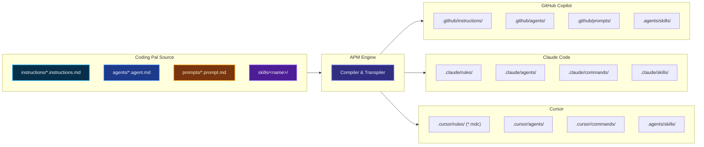

# Multi-Harness Distribution with APM

Coding Pal uses the [Agent Package Manager (APM)](https://microsoft.github.io/apm/) to compile, translate, and install persistent context primitives into multiple AI coding environments from a single source of truth.

## Target AI Harnesses

APM supports three primary AI coding harnesses:



## Where Files Land

Each AI environment expects persistent context in specific locations and formats. APM handles the translation automatically:

| Primitive | GitHub Copilot (`copilot`) | Claude Code (`claude`) | Cursor (`cursor`) |
|---|---|---|---|
| **Instructions** | `.github/instructions/*.instructions.md` | `.claude/rules/*.md` | `.cursor/rules/*.mdc` *(rewritten to MDC)* |
| **Agents** | `.github/agents/*.agent.md` | `.claude/agents/*.md` | `.cursor/agents/*.md` |
| **Prompts** | `.github/prompts/*.prompt.md` | `.claude/commands/*.md` *(compiled)* | `.cursor/commands/*.md` *(compiled)* |
| **Skills** | `.agents/skills/<name>/` *(shared)* | `.claude/skills/<name>/` | `.agents/skills/<name>/` *(shared)* |

> [!NOTE]
> Copilot and Cursor share the standard `.agents/skills/` layout, whereas Claude Code retains its target-native `.claude/skills/` directory.

---

## Consumer Configuration (`apm.yml`)

Consumer projects declare which Coding Pal primitives they require in their root `apm.yml`:

```yaml
# apm.yml — in consumer repository
name: my-service
version: 1.0.0
author: Engineering Team
targets:
  - copilot
  - claude
  - cursor
dependencies:
  apm:
    # 1. Virtual Path Dependencies (Agents & Prompts)
    - ALTEN-group/coding-pal/agents/unit-test.agent.md
    - ALTEN-group/coding-pal/agents/vitepress-docs.agent.md
    - ALTEN-group/coding-pal/prompts/node-unit-tests.prompt.md
    - ALTEN-group/coding-pal/prompts/vitepress-docs.prompt.md
    
    # 2. Virtual Path Dependencies (Instructions)
    - ALTEN-group/coding-pal/instructions/sharp-agent.instructions.md
    - ALTEN-group/coding-pal/instructions/node-express.instructions.md
    - ALTEN-group/coding-pal/instructions/node-unit-tests.instructions.md
    - ALTEN-group/coding-pal/instructions/docker.instructions.md
    - ALTEN-group/coding-pal/instructions/vitepress-docs.instructions.md
    
    # 3. Bundle Skill Dependencies (Folder Bundles)
    - git: ALTEN-group/coding-pal
      skills:
        - node-express-examples
        - docker-examples
        - vitepress-docs-examples
        - audit-reporting
  mcp: {}
```

> [!IMPORTANT]
> Because Coding Pal ships skills under `skills/`, APM treats the repository as a **skill bundle**. Agents and instructions must be declared as **virtual path dependencies** (e.g. `ALTEN-group/coding-pal/agents/...`). Do not nest agents or instructions under the `git: ALTEN-group/coding-pal` skill block.

---

## Installation & Maintenance Commands

### Install All Declared Dependencies
```bash
# Install for a specific target
apm install --target copilot

# Install for multiple targets simultaneously
apm install --target copilot,claude,cursor
```

### Install a Single Primitive (One-off)
```bash
# Install a single instruction
apm install ALTEN-group/coding-pal/instructions/sharp-agent.instructions.md --target copilot

# Install a single skill bundle
apm install ALTEN-group/coding-pal --skill audit-reporting --target copilot,claude
```

### Update Packages
```bash
apm update
```
This resolves the latest commit from Coding Pal and updates the project's lockfile (`apm.lock`). Never edit generated lockfiles manually.
