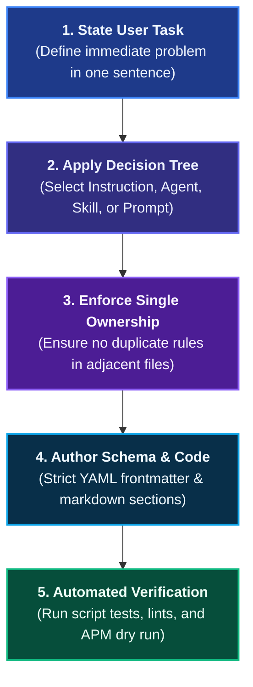

# Authoring & Contribution Guide

This guide defines the engineering standard for creating, testing, and contributing new persistent context primitives to Coding Pal.

## Authoring Workflow

Follow this five-step sequence before submitting a contribution:

### Step 1: State the User Task
Define the exact engineering task in one sentence (e.g., *"Scaffold a VitePress documentation website in a user-named folder"* or *"Remediate a single security finding from an audit report"*).

### Step 2: Apply the Decision Tree
Consult the authoritative [Persistent Context Decision Tree](./persistent-context.md#the-decision-tree) to select the correct primitive (**Instruction**, **Agent**, **Skill**, or **Prompt**) based on desired runtime activation and operational scope.

### Step 3: Enforce Single Ownership
Verify against existing primitives in `instructions/`, `agents/`, `skills/`, and `prompts/`. Adhere strictly to [Single Authoritative Ownership](./persistent-context.md#ownership-rules):
- Never duplicate conventions, report headings, or schemas across multiple files.
- Instructions own standards, agents own task scope, skills own contracts and validators, and prompts own user entry points.

### Step 4: Follow Precise Schemas
Adhere to the exact Markdown and frontmatter schemas:
- [Agent Schema](./schema-agents.md)
- [Prompt Schema](./schema-prompts.md)
- [Instruction Schema](./schema-instructions.md)
- [Skill Schema](./schema-skills.md)

### Step 5: Test Deterministically
When a skill produces machine-consumable artifacts (such as audit reports or OpenAPI specs):
- Implement an automated validator script in `scripts/`.
- Add positive and negative fixtures in `fixtures/`.
- Ensure tests verify edge cases: missing headings, malformed IDs, unexpected statuses.

---

## Review Checklist

Before opening a pull request, verify that every item on this checklist passes:

- [ ] **Correct Primitive Selected**: Choice matches the decision tree criteria.
- [ ] **Single Authoritative Owner**: No duplicated rules between instructions, agents, skills, or prompts.
- [ ] **Explicit Semantic Description**: Frontmatter `description` states both *what* it does and *when* to invoke it.
- [ ] **Narrowest `applyTo` Glob**: Instructions avoid `"**"` unless universally applicable.
- [ ] **Bounded Agent Method**: Agent specifies strict constraints, sequential approach, and falsifiable `Done When`.
- [ ] **Portable Skills**: Skills accept parameters (e.g. `--scope`) rather than hard-coding repo-specific paths.
- [ ] **No Leaky Contracts**: Agents say *"Follow the installed skill"* rather than copying output headings.
- [ ] **Machine Validation**: Deterministic validator scripts exist for structured output formats.
- [ ] **APM Installation Verified**: Clean test installation passes via `apm install`.
- [ ] **Docs Site Builds Cleanly**: `npm run build` in `website/` succeeds if documentation or catalog primitives were modified.

