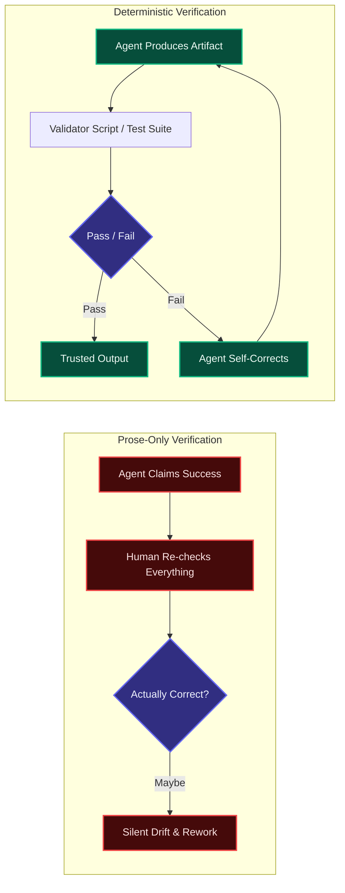
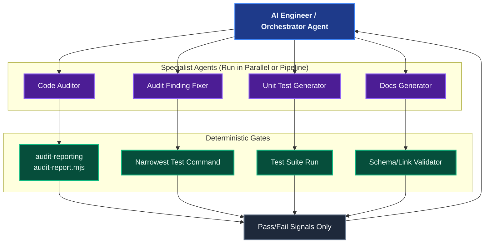

# Deterministic Controls: The Foundation of Autonomy

An AI assistant that cannot verify its own work can only ever be as trustworthy as the human reviewing every line behind it. **Deterministic Controls** are the mechanical, falsifiable checks — tests, validator scripts, schema contracts — that let an agent confirm its own output is correct *without* asking a human to re-read it first.

This capability is what turns a single supervised assistant into an autonomous worker, and eventually into an orchestrator capable of coordinating a fleet of other agents.

## Why "Trust Me" Doesn't Scale

Natural-language self-reporting ("I ran the tests and they pass", "This fix is complete") is not verification — it is a claim. Claims compound risk as autonomy increases:

Without a deterministic gate, every unit of agent autonomy is paid for with an equal unit of human review. With one, the agent absorbs its own review-and-repair loop, and the human only intervenes on a final pass/fail signal.

## The Autonomy Ladder

Deterministic controls are the prerequisite for each step up in scope:

| Level | Behavior | What Makes It Safe |
|---|---|---|
| **0 — Supervised** | Human reviews every change before it merges | Human is the only check; no controls needed, no autonomy either |
| **1 — Self-Checking Agent** | Agent runs the narrowest test command or a validator script before declaring "done" | A falsifiable **Done When** criterion replaces subjective confidence |
| **2 — Delegated Task** | An engineer hands an agent a whole feature or audit finding and walks away | The agent's own gate (tests, schema validation) is trusted as the completion signal |
| **3 — Multi-Agent Orchestration** | An orchestrator agent (or engineer) fans work out to several specialist agents in parallel or in sequence | Each specialist's output is independently, mechanically verifiable — the orchestrator never has to manually audit every sub-agent's work |

Coding Pal's [Golden Split](./persistent-context.md#the-golden-split) already encodes Level 1 and 2: agents own scope and method, instructions own standards, and **skills own the deterministic validator** that turns "I think this is correct" into "this passed."

## Orchestrating More Agents Requires More Determinism

The more agents an engineer coordinates at once, the less feasible it becomes to manually inspect each one's output. Orchestration at scale is only possible when every agent in the chain reports through a machine-checkable gate instead of prose:

Without those gates, the orchestrator (human or agent) becomes the bottleneck again — reading every diff from every specialist. With them, the orchestrator only needs to react to failures, freeing an AI engineer to run many more agents than they could ever personally review.

## What Counts as a Deterministic Control

| Mechanism | Example in Coding Pal | Owned By |
|---|---|---|
| **Validator script** | `skills/audit-reporting/scripts/audit-report.mjs` checks report structure | Skill |
| **Falsifiable Done When** | "Every file in scope has been reviewed" / "Narrowest test suite passes" | Agent |
| **Narrowest test command** | `npm test -- tests/auth.test.js` run after a surgical fix | Agent |
| **Schema/contract validation** | `references/report-contract.md` enforced against generated markdown | Skill |
| **Zero side-effect check** | Diff limited to files explicitly in scope, nothing else touched | Agent + Instruction |

A control only counts as deterministic if it produces the same verdict given the same input, regardless of which model or agent ran it. If the check depends on an LLM re-reading its own output and vouching for it, it is not yet deterministic — it is still a claim.

## Building New Deterministic Controls

When authoring a new agent or skill that should eventually run unsupervised or as part of an orchestrated pipeline:

1. **Define the completion criterion first.** Write the falsifiable "Done When" before writing the agent's method.
2. **Externalize the check.** Put the validation logic in a script or test, not in the agent's reasoning. Scripts belong in `skills/<name>/scripts/`, fixtures in `skills/<name>/fixtures/`.
3. **Make failure actionable.** The validator's output should tell the agent (or the next agent in the chain) exactly what to fix, not just pass/fail.
4. **Keep the gate cheap to run.** A control that takes longer than the task it verifies will not survive orchestration at scale.

## Next Steps

- Revisit the [Golden Split](./persistent-context.md#the-golden-split) to see how skills own validator scripts.
- See a full worked example in [Auditing & Remediation](./domain-audit.md), where CI gating rejects reports that fail schema validation.
- Browse the [Skills Catalog](./catalog-skills.md) for existing validator scripts to reuse.
