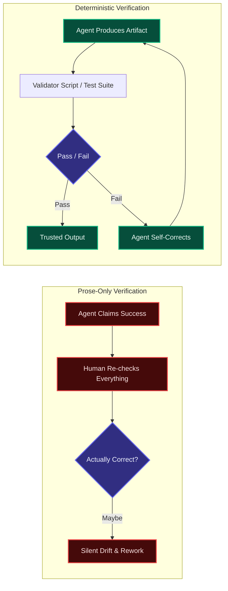
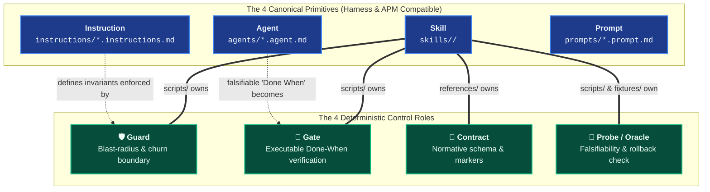
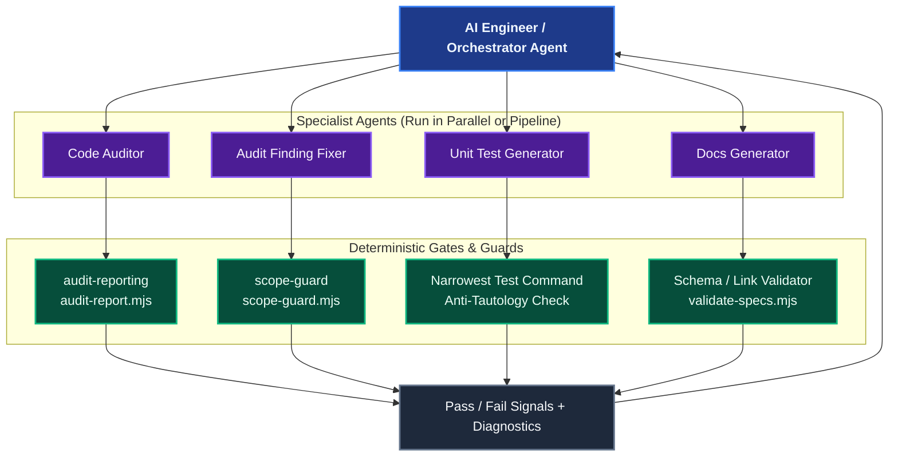

# Deterministic Controls: The Foundation of Autonomy

An AI assistant that cannot verify its own work can only ever be as trustworthy as the human reviewing every line behind it. **Deterministic Controls** are the mechanical, falsifiable checks — tests, validator scripts, schema contracts, diff guards — that let an agent confirm its own output is correct *without* asking a human to re-read it first.

This capability is what turns a single supervised assistant into an autonomous worker, giving the AI engineer the ability to orchestrate fleets of agents safely.

## Why "Trust Me" Doesn't Scale

Natural-language self-reporting ("I ran the tests and they pass", "This fix is complete") is not verification — it is a claim. Claims compound risk as autonomy increases:

Without a deterministic gate, every unit of agent autonomy is paid for with an equal unit of human review. With one, the agent absorbs its own review-and-repair loop, and the human only intervenes on a final pass/fail signal.

---

## The Autonomy Ladder

Deterministic controls are the prerequisite for each step up in scope:

| Level | Behavior | What Makes It Safe |
|---|---|---|
| **0 — Supervised** | Human reviews every change before it merges | Human is the only check; no controls needed, no autonomy either |
| **1 — Self-Checking Agent** | Agent runs the narrowest test command or a validator script before declaring "done" | A falsifiable **Done When** criterion replaces subjective confidence |
| **2 — Delegated Task** | An engineer hands an agent a whole feature or audit finding and walks away | The agent's own gate (tests, schema validation, scope guard) is trusted as the completion signal |
| **3 — Multi-Agent Orchestration** | An orchestrator agent (or engineer) fans work out to several specialist agents in parallel or in sequence | Each specialist's output is independently, mechanically verifiable — the orchestrator never has to manually audit every sub-agent's work |

Coding Pal's [Golden Split](./persistent-context.md#the-golden-split) encodes Levels 1 to 3: agents own scope and method, instructions own standards, and **deterministic primitives own the mechanical validators and guards** that turn "I think this is correct" into "this passed."

---

## The Four Deterministic Control Roles

In Coding Pal, persistent context is organized into four canonical primitives (**Instructions, Agents, Skills, and Prompts**) distributed via APM to GitHub Copilot, Claude Code, and Cursor. 

Rather than inventing incompatible file extensions that AI harnesses and package managers cannot load, **deterministic controls are organized into four architectural roles** that live inside and empower the canonical primitives:

### 1. 📄 Contracts (Normative Schemas)
* **Where It Lives**: Inside a **Skill** under `skills/<name>/references/`.
* **Purpose**: Authoritative machine-readable definition of markers, fields, and structures that downstream agents and CI workflows expect.
* *Examples in Coding Pal*:
  - `skills/contract-validator/references/contract-schema.md` & `validate-contract.mjs` (generic declarative schema validation).
  - `skills/audit-reporting/references/report-contract.md` (audit markers, finding categories, severity limits).
  - `skills/think-plan/references/think-plan-contract.md` (specification headings, invariant sections, bootability checklists).
  - `skills/scope-guard/references/guard-contract.md` (path matching semantics, forbidden file lists).

### 2. 🛡️ Guards (Blast-Radius & State Bounding)
* **Where It Lives**: Guided by **Instructions**; executed by **Skill scripts** (`skills/<name>/scripts/`).
* **Purpose**: Enforce mechanical boundaries on what an agent is permitted to touch during or after a code modification.
* *Mechanisms*:
  - **Scope Whitelisting**: Asserts that modified files match declared `allowedPaths` (`skills/scope-guard/scripts/scope-guard.mjs`).
  - **Dependency Bloat Sentinel**: Mechanically prevents unprompted additions to `package.json` or banned packages (`skills/dependency-guard/scripts/dependency-guard.mjs`).
  - **Secret & Credential Sentinel**: Scans diffs to prevent accidental hardcoding of AWS keys, private keys, or tokens (`skills/secret-guard/scripts/secret-guard.mjs`).
  - **Diff Churn Limiter**: Caps lines added and deleted to prevent unprompted mass refactorings.

### 3. 🚦 Gates & Verifiers (Falsifiable Completion Criteria)
* **Where It Lives**: Defined in an **Agent's `Done When`**; executed by **Skill scripts** (`skills/<name>/scripts/`) and CI/harness hooks.
* **Purpose**: Replaces subjective self-confidence ("I tested it and it works") with an executable verification command that yields 0 on success or structured diagnostics for agent self-repair.
* *Mechanisms*:
  - **Multi-Stage Verification Gate**: Runs linting, type checks, and narrowest tests sequentially with fail-fast semantics (`skills/task-gate/scripts/task-gate.mjs`).
  - **Specification Validator**: Checks that `think.md` and `plan.md` are structurally complete and bootable before build agents touch source code (`skills/think-plan/scripts/validate-specs.mjs`).
  - **Narrowest Test Command**: Runs the focused test suite specifically covering modified files (`npm test -- --findRelatedTests`).

### 4. 🎯 Probes & Oracles (Falsifiability Assertions)
* **Where It Lives**: Inside a **Skill** under `scripts/` and `fixtures/`.
* **Purpose**: Mechanically proves that a test or migration is genuinely falsifiable and non-vacuous.
* *Mechanisms*:
  - **Anti-Tautology Probe**: Stashes or reverts a code fix, runs the newly created test to assert it **fails** (proving it actually tests the bug), then restores the fix and asserts it passes (`skills/test-probe/scripts/test-probe.mjs`).
  - **Rollback & Roundtrip Oracle**: For database migrations or stateful scripts, executes `forward` $\rightarrow$ `rollback` $\rightarrow$ `forward` to mechanically verify that schema changes can be cleanly undone (`skills/rollback-probe/scripts/rollback-probe.mjs`).
  - **Performance Budget Gate**: Parses benchmark exports (e.g. `benchmark.json` from k6) and fails if latency or error thresholds are breached (`skills/k6-performance-examples/`).

---

## Deterministic Controls Across the Agent Lifecycle

Deterministic controls operate across four distinct phases of the agent execution lifecycle:

| Lifecycle Phase | Control Primitive | Deterministic Mechanism | Failure Remediation |
|---|---|---|---|
| **1. Ingress / Pre-flight** | `Baseline Sentinel` | Verifies clean git working tree, clean compilation, and passing test suite before agent edits. | Aborts early; prevents attributing pre-existing errors to the agent. |
| **2. In-flight / Execution** | `Guard` & `Hook` | Scope whitelisting (`allowedPaths`), forbidden lockfile detection, AST rule checking, diff churn limits. | Blocks unauthorized tool action; returns mechanical error to agent context. |
| **3. Egress / Completion** | `Gate` / `Verifier` | Structural Markdown/JSON validators, narrowest test run, lint and type checks (`tsc --noEmit`). | Prevents declaring completion; provides structured diagnostics for self-repair. |
| **4. Multi-Agent Hand-off** | `Contract` / `Oracle` | Inter-agent artifact validation (e.g., `validate-specs.mjs` verifying `think.md` before `plan.md` starts). | Rejects artifact hand-off; halts orchestration pipeline before errors compound. |

---

## Orchestrating Fleets with Deterministic Gates

The more agents an engineer or orchestrator coordinates, the less feasible it becomes to manually inspect each output. Orchestration at scale is only possible when every agent in the chain reports through a machine-checkable gate instead of prose:

Without those gates, the orchestrator (human or agent) becomes the bottleneck again — reading every diff from every specialist. With them, the orchestrator only needs to react to failures, freeing an AI engineer to run many more agents than they could ever personally review.

---

## What Counts as a Deterministic Control

| Mechanism | Example in Coding Pal | Owned By |
|---|---|---|
| **Blast-radius diff guard** | `skills/scope-guard/scripts/scope-guard.mjs` checks modified paths & churn | Guard (`skills/scope-guard`) |
| **Dependency bloat sentinel** | `skills/dependency-guard/scripts/dependency-guard.mjs` checks package manifests | Guard (`skills/dependency-guard`) |
| **Secret & credential guard** | `skills/secret-guard/scripts/secret-guard.mjs` scans diffs for keys & tokens | Guard (`skills/secret-guard`) |
| **Multi-stage verification gate** | `skills/task-gate/scripts/task-gate.mjs` runs lint/build/tests with self-repair diagnostics | Gate (`skills/task-gate`) |
| **Declarative contract validator** | `skills/contract-validator/scripts/validate-contract.mjs` asserts artifact schema | Contract (`skills/contract-validator`) |
| **Anti-tautology falsifiability probe** | `skills/test-probe/scripts/test-probe.mjs` verifies tests fail when fix is removed | Probe (`skills/test-probe`) |
| **Migration rollback probe** | `skills/rollback-probe/scripts/rollback-probe.mjs` verifies reversibility & idempotency | Probe (`skills/rollback-probe`) |
| **Artifact validator script** | `skills/audit-reporting/scripts/audit-report.mjs` checks report structure | Gate (Skill) |
| **Specification validator** | `skills/think-plan/scripts/validate-specs.mjs` checks heading sequence & bootability | Gate (Skill) |
| **Falsifiable Done When** | "Every file in scope has been reviewed" / "Narrowest test suite passes" | Agent |
| **Narrowest test command** | `npm test -- tests/auth.test.js` run after a surgical fix | Agent |
| **Schema/contract validation** | `references/contract-schema.md`, `references/guard-contract.md` | Contract (Skill) |

A control only counts as deterministic if it produces the same verdict given the same input, regardless of which model or agent ran it. If the check depends on an LLM re-reading its own output and vouching for it, it is not yet deterministic — it is still a claim.

---

## Building New Deterministic Controls

When authoring a new agent or skill that should eventually run unsupervised or as part of an orchestrated pipeline:

1. **Define the completion criterion first.** Write the falsifiable "Done When" before writing the agent's method.
2. **Externalize the check.** Put the validation logic in a script or test, not in the agent's reasoning. Scripts belong in `skills/<name>/scripts/`, fixtures in `skills/<name>/fixtures/`.
3. **Make failure actionable.** The validator's output should tell the agent (or the next agent in the chain) exactly what to fix, not just pass/fail.
4. **Keep the gate cheap to run.** A control that takes longer than the task it verifies will not survive orchestration at scale.

## Next Steps

- Revisit the [Golden Split](./persistent-context.md#the-golden-split) to see how skills and guards distribute ownership.
- See a full worked example in [Audit & Remediation](./domain-audit.md), where CI gating rejects reports that fail schema validation.
- Browse the [Skills Catalog](./catalog-skills.md) for existing validator scripts and guards.
