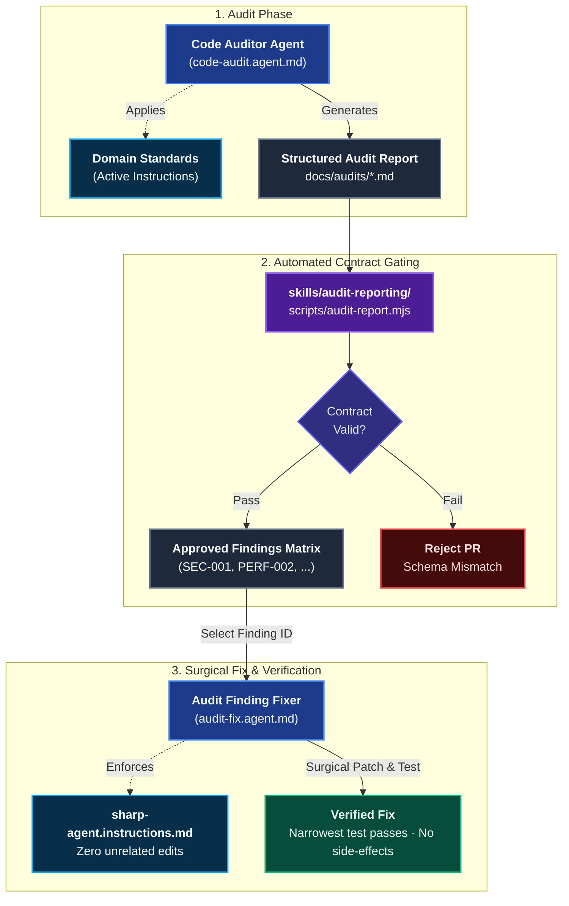

# Audit & Remediation

The **Audit & Remediation** domain provides automated, evidence-based code review and surgical vulnerability/defect remediation. It transforms subjective code reviews into reproducible, schema-validated artifacts backed by CI gating.

---

## Domain Architecture



---

## Capabilities Matrix

| Capability | Role | Specialist Agent | Scoping Instruction | Protocol & Skill Bundle | Gating Mechanism |
|---|---|---|---|---|---|
| **Codebase Audit** | Full codebase assessment | [`Code Auditor`](./catalog-agents.md#1-code-auditor) | Matching domain instructions | [`audit-reporting`](./catalog-skills.md#1-audit-reporting) | CI schema validation script |
| **Surgical Defect Fix** | Remediation of single finding | [`Audit Finding Fixer`](./catalog-agents.md#2-audit-finding-fixer) | [`sharp-agent`](./catalog-instructions.md#1-sharp-agent) | [`audit-reporting`](./catalog-skills.md#1-audit-reporting) | Narrowest test command execution |

---

## Capability Workflows

### 1. Codebase Audit

- **When to Run**: Repository onboarding, architectural milestone reviews, security checks, and release gates.
- **Agent**: [`Code Auditor`](./catalog-agents.md#1-code-auditor) (`code-audit.agent.md`)
- **Execution Methodology**:
  1. **Scope Agreement**: Confines analysis strictly to the requested repository, microservice, or subdirectory.
  2. **Stack Discovery**: Examines package manifests (`package.json`), Dockerfiles, and database changelogs.
  3. **Standard Application**: Applies active Coding Pal instructions (e.g. `node-express.instructions.md`, `postgres-liquibase.instructions.md`) as the normative criteria.
  4. **Exhaustive Reading**: Reads every source file within the agreed boundary before formulating findings (no speculative or hallucinated issues).
  5. **Standardized Report**: Generates a structured markdown report under `docs/audits/` adhering to the contract defined in [`skills/audit-reporting/references/report-contract.md`](./catalog-skills.md#1-audit-reporting).
- **Falsifiable Done When**:
  - Every file in scope has been reviewed.
  - The audit report compiles and passes validation via the skill script:
    ```bash
    node .agents/skills/audit-reporting/scripts/audit-report.mjs --input docs/audits/code-audit.md --output docs/audits/code-audit.md
    ```

### 2. Surgical Finding Remediation

- **When to Run**: Addressing a specific finding from an approved audit report.
- **Agent**: [`Audit Finding Fixer`](./catalog-agents.md#2-audit-finding-fixer) (`audit-fix.agent.md`)
- **Governing Constraints**:
  - **One Finding Mandate**: Takes a single finding identifier (e.g., `SEC-001`, `PERF-003`, `MAINT-007`).
  - **Zero Speculative Refactoring**: Prohibited from rewriting adjacent code, changing naming schemes, or introducing new third-party dependencies unless strictly required.
  - **Governed by Sharp Agent**: Adheres to [`sharp-agent.instructions.md`](./catalog-instructions.md#1-sharp-agent) to prevent token waste and scope creep.
- **Execution Methodology**:
  1. Reads the finding description, file paths, line numbers, and recommended remediation from the audit report.
  2. Applies the minimal, targeted modification directly to the affected lines.
  3. Executes the project's narrowest test command covering that code (e.g. `npm test -- tests/auth.test.js`).
- **Falsifiable Done When**:
  - The finding condition is resolved.
  - The narrowest test suite passes.
  - Untouched code and unrelated files remain completely unmodified.

---

## The Audit Report Protocol

The audit report protocol provided by `skills/audit-reporting/` enforces deterministic structure bounded by exact markers:

```markdown
<!-- AUDIT-REPORT:START -->
# Code Audit Report: [Target]

## Executive Summary
Concise summary of risk and priority (1-3 short paragraphs, max 1,200 characters).

## Critical
### SQL concatenation in search query
- **Location:** `src/services/user.js:42`
- **Category:** Security
- **Evidence:** Concrete query concatenates unescaped userInput directly into SQL string.
- **Impact:** Unauthenticated SQL injection leading to arbitrary data exfiltration.
- **Recommendation:** Use parameterized query bindings via pg-promise / knex query builder.

## Important
_No findings._

## Suggestions
_No findings._
<!-- AUDIT-REPORT:END -->
```

The script normalizes and sorts findings, assigns canonical `AUDIT-001` identifiers, and adds summary counts to each severity heading.

---

## Related Catalogs & Schemas

- [Agents Catalog](./catalog-agents.md)
- [Instructions Catalog](./catalog-instructions.md)
- [Skills Catalog](./catalog-skills.md)
- [Agent Markdown Schema](./schema-agents.md)
- [Skills Markdown Schema](./schema-skills.md)
