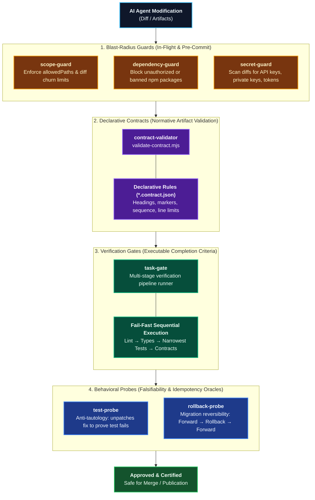

# Deterministic Controls & Safeguards

The **Deterministic Controls** domain provides machine-executable safeguards, blast-radius boundaries, declarative contracts, and behavioral probes that transform subjective AI code generation into verifiable, industrial-grade software engineering pipelines.

While persistent instructions and agent personas guide an LLM's intent, **deterministic controls guarantee outcomes**. If a check depends on a model re-reading its own diff and vouching for it, it remains an unverified claim. A control is only deterministic if it yields the exact same pass/fail verdict given the same input, regardless of which model, prompt, or agent generated the code.

---

## Domain Architecture

The control domain operates across four interlocking defensive rings covering the entire code modification lifecycle:



---

## Capabilities Matrix

| Capability | Role | Skill Package | Contract & Schema | Executable Engine | Primary Failure Mode Solved |
|---|---|---|---|---|---|
| **Scope & Blast-Radius** | 🛡️ Guard | [`skills/scope-guard/`](./catalog-skills.md#10-scope-guard) | [`guard-contract.md`](file:///Users/Shared/Projects/alten/coding-pal/skills/scope-guard/references/guard-contract.md) | `scope-guard.mjs` | Modifying out-of-scope files, lockfiles, `.env`, or exceeding churn thresholds. |
| **Dependency Containment** | 🛡️ Guard | [`skills/dependency-guard/`](./catalog-skills.md#15-dependency-guard) | [`dependency-contract.md`](file:///Users/Shared/Projects/alten/coding-pal/skills/dependency-guard/references/dependency-contract.md) | `dependency-guard.mjs` | Silently adding unvetted dependencies to `package.json` or importing banned libraries. |
| **Secret Leak Prevention** | 🛡️ Guard | [`skills/secret-guard/`](./catalog-skills.md#16-secret-guard) | [`secret-contract.md`](file:///Users/Shared/Projects/alten/coding-pal/skills/secret-guard/references/secret-contract.md) | `secret-guard.mjs` | Hardcoding cloud keys (AWS), SSH/PGP private keys, platform tokens, or credentials. |
| **Multi-Stage Task Gate** | 🚦 Gate | [`skills/task-gate/`](./catalog-skills.md#11-task-gate) | [`gate-contract.md`](file:///Users/Shared/Projects/alten/coding-pal/skills/task-gate/references/gate-contract.md) | `task-gate.mjs` | Premature completion claims; provides decisive error snippets for agent self-repair. |
| **Declarative Artifact Schema** | 📄 Contract | [`skills/contract-validator/`](./catalog-skills.md#13-contract-validator) | [`contract-schema.md`](file:///Users/Shared/Projects/alten/coding-pal/skills/contract-validator/references/contract-schema.md) | `validate-contract.mjs` | Generating malformed Markdown/JSON artifacts lacking required markers or headings. |
| **Anti-Tautology Testing** | 🎯 Probe | [`skills/test-probe/`](./catalog-skills.md#14-test-probe) | [`probe-contract.md`](file:///Users/Shared/Projects/alten/coding-pal/skills/test-probe/references/probe-contract.md) | `test-probe.mjs` | Writing vacuous tests that pass unconditionally without proving the underlying bugfix. |
| **Migration Reversibility** | 🎯 Probe | [`skills/rollback-probe/`](./catalog-skills.md#17-rollback-probe) | [`rollback-contract.md`](file:///Users/Shared/Projects/alten/coding-pal/skills/rollback-probe/references/rollback-contract.md) | `rollback-probe.mjs` | Authoring irreversible database migrations or broken `<rollback>` and `DOWN` scripts. |

---

## Detailed Control Workflows

### 1. Scope & Blast-Radius Guard (`skills/scope-guard/`)

- **Role**: 🛡️ Guard
- **When to Use**: During agent code editing, PR preparation, and in pre-commit git hooks.
- **Governing Contract**: [`guard-contract.md`](file:///Users/Shared/Projects/alten/coding-pal/skills/scope-guard/references/guard-contract.md)
- **Workflow & Command**:
  ```bash
  # Check git working tree changes against allowed scopes
  node .agents/skills/scope-guard/scripts/scope-guard.mjs \
    --scope "src/auth/**,tests/auth/**" \
    --git \
    --max-additions 150 \
    --max-deletions 50
  ```
- **Invariants Enforced**:
  - Every modified file must match declared glob patterns in `--scope`.
  - Automatic rejection of forbidden sentinels (`package-lock.json`, `.env*`, root configs) unless explicitly allowed.
  - Strict churn thresholds on additions and deletions prevent mass refactorings.

---

### 2. Dependency Containment Guard (`skills/dependency-guard/`)

- **Role**: 🛡️ Guard
- **When to Use**: Whenever an agent touches package manifests (`package.json`, `pom.xml`, `requirements.txt`).
- **Governing Contract**: [`dependency-contract.md`](file:///Users/Shared/Projects/alten/coding-pal/skills/dependency-guard/references/dependency-contract.md)
- **Workflow & Command**:
  ```bash
  # Check git changes to package.json against baseline HEAD
  node .agents/skills/dependency-guard/scripts/dependency-guard.mjs --git

  # Permit specific, pre-approved additions
  node .agents/skills/dependency-guard/scripts/dependency-guard.mjs --git --allow "zod,dotenv"
  ```
- **Invariants Enforced**:
  - Rejects additions to `dependencies` or `devDependencies` without explicit `--allow` authorization.
  - Automatically flags banned or deprecated libraries (`moment`, `request`, `left-pad`).
  - Detects and rejects unpinned wildcard versions (`*`, `latest`).

---

### 3. Secret & Credential Guard (`skills/secret-guard/`)

- **Role**: 🛡️ Guard
- **When to Use**: Before any commit or patch generation to ensure zero confidential credentials leak.
- **Governing Contract**: [`secret-contract.md`](file:///Users/Shared/Projects/alten/coding-pal/skills/secret-guard/references/secret-contract.md)
- **Workflow & Command**:
  ```bash
  # Scan added lines in git diff against HEAD
  node .agents/skills/secret-guard/scripts/secret-guard.mjs --git

  # Scan specific source files directly
  node .agents/skills/secret-guard/scripts/secret-guard.mjs --file src/config.js --file src/api.js
  ```
- **Invariants Enforced**:
  - Detects AWS Access Key IDs (`AKIA[0-9A-Z]{16}`).
  - Detects Cryptographic Private Key blocks (`-----BEGIN ... PRIVATE KEY-----`).
  - Detects platform tokens (`ghp_*`, Slack `xox*`) and high-entropy credential assignments.
  - Automatically masks matched credentials in violation outputs to prevent log leakage.

---

### 4. Multi-Stage Task Gate (`skills/task-gate/`)

- **Role**: 🚦 Gate
- **When to Use**: Inside an agent's `Done When` declaration and CI verification jobs.
- **Governing Contract**: [`gate-contract.md`](file:///Users/Shared/Projects/alten/coding-pal/skills/task-gate/references/gate-contract.md)
- **Workflow & Command**:
  ```bash
  # Execute verification stages with fail-fast execution and self-repair diagnostics
  node .agents/skills/task-gate/scripts/task-gate.mjs \
    --stage "lint:npm run lint" \
    --stage "types:npx tsc --noEmit" \
    --stage "test:npm test -- tests/auth.test.js" \
    --fail-fast
  ```
- **Invariants Enforced**:
  - Sequential execution terminates on the first failing stage to conserve agent token budget.
  - Extracts the tail failure snippet (stderr/stdout) into an actionable diagnostic payload for automated self-repair.
  - Emits machine-readable `--json` output for automated harness ingestion.

---

### 5. Declarative Artifact Contract Validator (`skills/contract-validator/`)

- **Role**: 📄 Contract
- **When to Use**: Certifying markdown deliverables (architecture plans, audit reports, specs, RFCs).
- **Governing Contract**: [`contract-schema.md`](file:///Users/Shared/Projects/alten/coding-pal/skills/contract-validator/references/contract-schema.md)
- **Workflow & Command**:
  ```bash
  # Declaratively validate an artifact against a JSON contract definition
  node .agents/skills/contract-validator/scripts/validate-contract.mjs \
    --contract contracts/audit-report.contract.json \
    --file docs/audits/security.md
  ```
- **Invariants Enforced**:
  - Requires presence of framing comments (e.g., `<!-- AUDIT-REPORT:START -->`).
  - Asserts exact heading hierarchy and strict heading sequence.
  - Enforces maximum line counts to prevent context window overflow.
  - Rejects forbidden placeholder patterns (`TODO`, `TBD`, placeholder ellipses).

---

### 6. Anti-Tautology Test Probe (`skills/test-probe/`)

- **Role**: 🎯 Probe / Oracle
- **When to Use**: When an agent authors unit or integration tests, to prove the tests actually verify the fix.
- **Governing Contract**: [`probe-contract.md`](file:///Users/Shared/Projects/alten/coding-pal/skills/test-probe/references/probe-contract.md)
- **Workflow & Command**:
  ```bash
  # Assert test suite fails when source fix is temporarily reverted
  node .agents/skills/test-probe/scripts/test-probe.mjs \
    --test-cmd "npm test -- tests/auth.test.js" \
    --source "src/auth/service.js"
  ```
- **Invariants Enforced**:
  - Asserts that modified code passes the test suite initially.
  - Temporarily inverts/reverts the source file to baseline `HEAD`.
  - Re-executes the test command against unpatched code: **fails if tests pass (tautological test detected)**!
  - Atomically restores the modified source file in a `finally` block regardless of test outcomes.

---

### 7. Migration Rollback Probe (`skills/rollback-probe/`)

- **Role**: 🎯 Probe / Oracle
- **When to Use**: Certifying database schema migrations (Liquibase, Flyway, Prisma, raw SQL).
- **Governing Contract**: [`rollback-contract.md`](file:///Users/Shared/Projects/alten/coding-pal/skills/rollback-probe/references/rollback-contract.md)
- **Workflow & Command**:
  ```bash
  # Certify migration reversibility and idempotency via roundtrip execution
  node .agents/skills/rollback-probe/scripts/rollback-probe.mjs \
    --forward "npm run migrate:up" \
    --rollback "npm run migrate:down" \
    --verify "npm test -- tests/db.test.js"
  ```
- **Invariants Enforced**:
  - Executes `1_FORWARD` migration (must exit 0).
  - Executes `2_ROLLBACK` migration (must exit 0, proving inverse operation works).
  - Executes `3_REAPPLY_FORWARD` migration (must exit 0, proving rollback left a pristine state).
  - Runs optional verification assertion certifying schema and data integrity.

---

## Harness & CI Integration

### Wiring Controls into Agent `Done When`

Instead of subjective completion criteria, reference deterministic skill scripts in your agent's `Done When` block:

```markdown
## Done When

- The assigned defect or feature requirement is resolved in code.
- Blast-radius guard exits with code 0:
  ```bash
  node .agents/skills/scope-guard/scripts/scope-guard.mjs --scope "src/auth/**" --git
  ```
- Security guard detects 0 hardcoded credentials:
  ```bash
  node .agents/skills/secret-guard/scripts/secret-guard.mjs --git
  ```
- Verification gate passes all stages:
  ```bash
  node .agents/skills/task-gate/scripts/task-gate.mjs --stage "lint:npm run lint" --stage "test:npm test -- tests/auth.test.js"
  ```
- Anti-tautology probe confirms test falsifiability:
  ```bash
  node .agents/skills/test-probe/scripts/test-probe.mjs --test-cmd "npm test -- tests/auth.test.js" --source "src/auth/service.js"
  ```
```

### Pre-Commit Git Hook

Automate developer and agent safeguards locally before changes can be committed:

```bash
#!/usr/bin/env bash
# .git/hooks/pre-commit
set -e

echo "Running Coding Pal Deterministic Safeguards..."
node .agents/skills/scope-guard/scripts/scope-guard.mjs --git
node .agents/skills/dependency-guard/scripts/dependency-guard.mjs --git
node .agents/skills/secret-guard/scripts/secret-guard.mjs --git
echo "Safeguards passed cleanly."
```

---

## Related Catalogs & Schemas

- [Deterministic Controls Architecture](./deterministic-controls.md)
- [Skills Catalog](./catalog-skills.md)
- [Persistent Context & Golden Split](./persistent-context.md)
- [APM Distribution Manifest](./apm-distribution.md)
