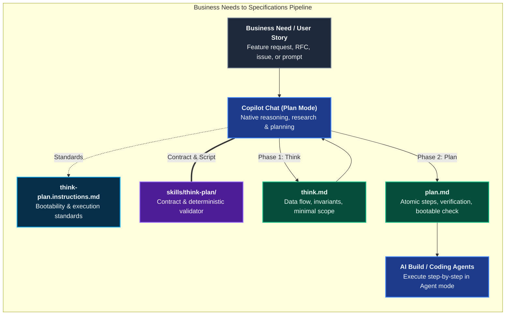
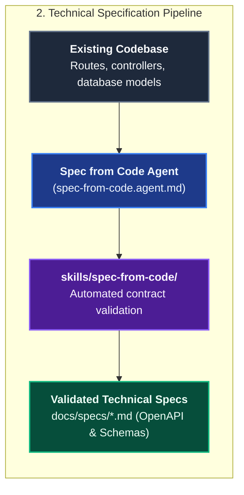
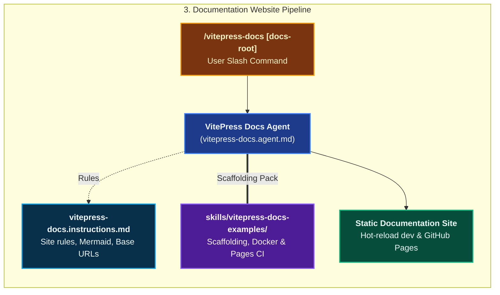
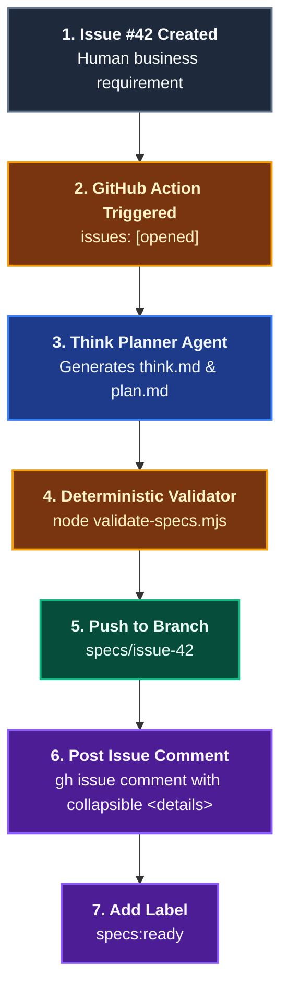

# Architecture & Documentation

The **Architecture & Documentation** domain provides automated capabilities to turn business needs into machine-consumable specifications (`think.md` and `plan.md`), reverse-engineer technical specifications from existing source code, and scaffold enterprise-grade product documentation websites.

---

## Domain Architecture

### 1. Business Needs to Specifications (Think & Plan Pipeline)

Rather than writing narrative PRDs that overwhelm AI agent context, specifications are produced by a clean two-stage pipeline: **Think** (`think.md`) followed by **Plan** (`plan.md`). Downstream build agents consume these persistent artifacts to implement functionality step-by-step with zero hallucinated requirements.



### 2. Reverse-Engineering Specifications (spec-from-code)



### 3. Documentation Website Pipeline



---

## Capabilities Matrix

| Capability | Invocation / Entry Point | Scoping Instruction | Supporting Skill | Output Artifact |
|---|---|---|---|---|
| **Business Needs to Specifications** | Copilot Plan Mode or [`Think Planner`](./catalog-agents.md#9-think-planner) agent (CI) | [`think-plan`](./catalog-instructions.md#documentation--architecture-instructions) | [`think-plan`](./catalog-skills.md#10-think-plan) | `specs/think.md` and `specs/plan.md` (System flows, invariants, atomic checklist, bootability checks) |
| **Spec from Code** | Explicit prompt / agent | Domain instructions | [`spec-from-code`](./catalog-skills.md#2-spec-from-code) | `docs/specs/*.md` (OpenAPI, DB schemas, async jobs) |
| **VitePress Docs Site** | [`/vitepress-docs`](./catalog-prompts.md#5-vitepress-docs) | [`vitepress-docs`](./catalog-instructions.md#documentation--architecture-instructions) | [`vitepress-docs-examples`](./catalog-skills.md#3-vitepress-docs-examples) | Full VitePress site (`website/docs/`, Docker, CI) |

---

## Capability Workflows

### 1. Business Needs to Specifications: Think & Plan

- **When to Run**: Before authoring code for any non-trivial business need, user story, feature request, or architectural change. Can be run interactively in the IDE (Copilot Plan mode) or headlessly in CI/CD when a GitHub issue is opened.
- **Why It Replaces Traditional Specs**:
  - Traditional PRDs and narrative design docs are verbose, full of unstated assumptions, and swamp the LLM context window with conversational prose.
  - In an agentic operating model, specifications are actionable data structures for models:
    1. `think.md` grounds the LLM in real codebase architecture, data flows, invariants, and bounds the minimal change footprint.
    2. `plan.md` sequences the implementation into atomic, dependency-ordered steps where each step verifies local functionality and asserts the application remains bootable.
  - Downstream build agents consume `plan.md` one step at a time in fresh context sessions, preventing error compounding.
- **Workflow Steps**:
  1. **Phase 1: Think**:
     - *Interactive (IDE)*: Open Copilot Chat in **Plan** mode and prompt with the business requirement: *"Analyze the business need for [feature] and save findings to specs/think.md."*
     - *Headless (GitHub Action)*: Triggered on `issues: [opened]`, invoking the **Think Planner** agent (`think-plan.agent.md`) with the issue title and body.
     - The `think-plan.instructions.md` standard automatically loads, ensuring the model traces existing flows, maps component responsibilities, respects invariants, and confines scope without writing code.
     - Emits `specs/think.md` conforming to [`skills/think-plan/references/think-plan-contract.md`](./catalog-skills.md#10-think-plan).
  2. **Phase 2: Plan**:
     - *Interactive (IDE)*: In a clean Plan mode session: *"From specs/think.md, generate specs/plan.md."*
     - *Headless (CI)*: The **Think Planner** agent automatically synthesizes `specs/plan.md` directly from the validated `think.md`.
     - Emits `specs/plan.md` containing atomic steps with explicit `Files:`, `Action:`, `Verification:`, and `Bootable Check:`.
  3. **Phase 3: Automated Validation**:
     - Specs are deterministically validated via the skill validator:
       ```bash
       node .agents/skills/think-plan/scripts/validate-specs.mjs --dir specs
       ```
  4. **Phase 4: Agentic Build (Agent Mode)**:
     - Switch Copilot Chat to **Agent** mode with clean context (or launch an autonomous build agent).
     - Prompt: *"From specs/plan.md, implement Step 1 only."*
     - The agent executes one verified step at a time, keeping the application bootable throughout.

#### Storage & GitHub Issue Attachment Pattern

When automating specifications from GitHub issues in CI/CD, specifications follow the **Issue Comment + Dedicated Branch** pattern:



1. **Non-destructive Issue Comment**: The action **never overwrites** the issue description. Leaving the human product owner's original words intact preserves the authentic requirement while keeping discussions and reviews threaded.
2. **Collapsible Visual Layout**: Full specifications are posted in a comment formatted with HTML `<details>` tags:
   - `think.md` enclosed in `<details><summary>🧠 <b>think.md (System Flow & Invariants)</b></summary> ... </details>`.
   - `plan.md` enclosed in `<details open><summary>📝 <b>plan.md (Implementation Steps)</b></summary> ... </details>`.
3. **Dedicated Branch Storage**: Files are committed to `specs/issue-<number>/` on branch `specs/issue-<number>`, providing clean filesystem access for downstream build agents.

- **Falsifiable Done When**:
  - `think.md` and `plan.md` pass `skills/think-plan/scripts/validate-specs.mjs` with exit code 0.
  - Zero code was modified during specification generation.

### 2. Reverse-Engineering Specifications: Spec from Code

- **When to Run**: Documenting legacy codebases, standardizing undocumented microservices, or preparing API catalogs.
- **Agent**: [`Spec from Code`](./catalog-agents.md#3-spec-from-code) (`spec-from-code.agent.md`)
- **Execution Methodology**:
  1. Inspects route definitions, controller parameters, middleware validation schemas, and database entity models.
  2. Extracts public endpoints, HTTP methods, headers, payload schemas, query parameters, response structures, and error codes.
  3. Formulates technical specifications conforming to the [`skills/spec-from-code/references/spec-contract.md`](./catalog-skills.md#2-spec-from-code) contract.
  4. Documents database tables, columns, indexes, foreign keys, triggers, and soft-delete policies.
- **Falsifiable Done When**:
  - All public interfaces are documented without omissions.
  - The specification passes automated validation via the skill script:
    ```bash
    node .agents/skills/spec-from-code/scripts/spec-docs.mjs --dir docs/specs
    ```

### 3. Product Documentation Website: VitePress Docs

- **When to Run**: Launching or upgrading a product documentation site for an open-source library, microservice catalog, or company platform.
- **Trigger**: `/vitepress-docs [docs-root]`
- **Agent**: [`VitePress Docs`](./catalog-agents.md#6-vitepress-docs) (`vitepress-docs.agent.md`)
- **Scaffolding Bundle**: Uses [`skills/vitepress-docs-examples`](./catalog-skills.md#3-vitepress-docs-examples) to supply pre-configured scaffolding assets:
  - `package.json` with pinned VitePress, Mermaid, and Markdown plugins.
  - `.vitepress/config.mjs` pre-configured with theme settings, responsive SVG logo/favicon, Mermaid optimization, and dynamic base URL resolution for GitHub Pages / local dev.
  - Multi-service Docker Compose files (`scripts/start-dev.sh`, `scripts/stop-dev.sh`, `docker/docker-compose.yml`) enabling hot-reloaded local editing on port 5174 without local Node.js dependencies.
  - GitHub Actions deployment workflow (`.github/workflows/deploy-docs.yml`) with zero-downtime GitHub Pages deployment.
- **Falsifiable Done When**:
  - `npm run build` generates static HTML with 0 errors.
  - `./scripts/start-dev.sh` runs cleanly in Docker.
  - All pages and mermaid diagrams render cleanly in dark and light themes.

---

## Related Catalogs & Schemas

- [Prompts Catalog](./catalog-prompts.md)
- [Agents Catalog](./catalog-agents.md)
- [Instructions Catalog](./catalog-instructions.md)
- [Skills Catalog](./catalog-skills.md)
- [Prompts Markdown Schema](./schema-prompts.md)
- [Agents Markdown Schema](./schema-agents.md)
