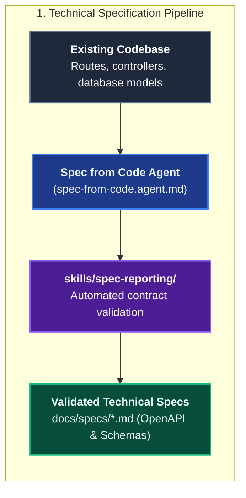

# Architecture & Documentation

The **Architecture & Documentation** domain provides automated capabilities to reverse-engineer technical specifications from source code and scaffold enterprise-grade product documentation websites.

---

## Domain Architecture

### 1. Technical Specification Pipeline



### 2. Documentation Website Pipeline


---

## Capabilities Matrix

| Capability | Slash Prompt | Specialist Agent | Scoping Instruction | Supporting Skill | Output Artifact |
|---|---|---|---|---|---|
| **Spec from Code** | — | [`Spec from Code`](./catalog-agents.md#3-spec-from-code) | Domain instructions | [`spec-reporting`](./catalog-skills.md#2-spec-reporting) | `docs/specs/*.md` (OpenAPI, DB schemas, async jobs) |
| **VitePress Docs Site** | [`/vitepress-docs`](./catalog-prompts.md#5-vitepress-docs) | [`VitePress Docs`](./catalog-agents.md#5-vitepress-docs) | [`vitepress-docs`](./catalog-instructions.md#10-vitepress-docs) | [`vitepress-docs-examples`](./catalog-skills.md#3-vitepress-docs-examples) | Full VitePress site (`website/docs/`, Docker, CI) |

---

## Capability Workflows

### 1. Reverse-Engineering Specifications (`spec-from-code`)

- **When to Run**: Documenting legacy codebases, standardizing undocumented microservices, or preparing API catalogs.
- **Agent**: [`Spec from Code`](./catalog-agents.md#3-spec-from-code) (`spec-from-code.agent.md`)
- **Execution Methodology**:
  1. Inspects route definitions, controller parameters, middleware validation schemas, and database entity models.
  2. Extracts public endpoints, HTTP methods, headers, payload schemas, query parameters, response structures, and error codes.
  3. Formulates technical specifications conforming to the [`skills/spec-reporting/references/spec-contract.md`](./catalog-skills.md#2-spec-reporting) contract.
  4. Documents database tables, columns, indexes, foreign keys, triggers, and soft-delete policies.
- **Falsifiable Done When**:
  - All public interfaces are documented without omissions.
  - The specification passes automated validation via the skill script:
    ```bash
    node .agents/skills/spec-reporting/scripts/spec-docs.mjs --spec docs/specs/api-spec.md
    ```

### 2. Product Documentation Website (`/vitepress-docs`)

- **When to Run**: Launching or upgrading a product documentation site for an open-source library, microservice catalog, or company platform.
- **Trigger**: `/vitepress-docs [docs-root]`
- **Agent**: [`VitePress Docs`](./catalog-agents.md#5-vitepress-docs) (`vitepress-docs.agent.md`)
- **Scaffolding Bundle**: Uses [`skills/vitepress-docs-examples`](./catalog-skills.md#3-vitepress-docs-examples) to supply pre-configured scaffolding assets:
  - `package.json` with pinned VitePress, Mermaid, and Markdown plugins.
  - `.vitepress/config.mjs` pre-configured with theme settings, responsive SVG logo/favicon, Mermaid optimization, and dynamic base URL resolution for GitHub Pages / local dev.
  - Multi-service Docker Compose files (`scripts/start-dev.sh`, `scripts/stop-dev.sh`, `docker/docker-compose.yml`) enabling hot-reloaded local editing on port 5174 without local Node.js dependencies.
  - GitHub Actions deployment workflow (`.github/workflows/deploy-docs.yml`) with zero-downtime GitHub Pages deployment.
- **Falsifiable Done When**:
  - `npm run build` generates static HTML with 0 errors.
  - `./scripts/start-dev.sh` runs cleanly in Docker.
  - All pages and mermaid diagrams render cleanly in dark and light themes.

---

## Related Catalogs & Schemas

- [Prompts Catalog](./catalog-prompts.md)
- [Agents Catalog](./catalog-agents.md)
- [Instructions Catalog](./catalog-instructions.md)
- [Skills Catalog](./catalog-skills.md)
- [Prompts Markdown Schema](./schema-prompts.md)
- [Agents Markdown Schema](./schema-agents.md)
