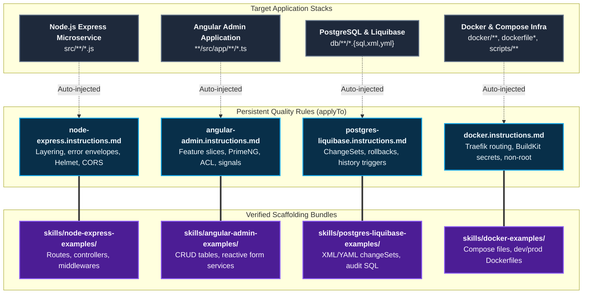

# Tech Stacks

The **Tech Stacks** domain codifies enterprise engineering conventions, architectural patterns, and verified scaffolding bundles for modern production tech stacks.

Rather than relying on the LLM's generic defaults, Coding Pal injects precise conventions whenever files matching these stacks are opened or edited.

---

## Domain Architecture

---

## Capabilities Matrix

| Tech Stack | Focus Area | Persistent Instruction | Scaffolding Skill Bundle | Target Path Pattern |
|---|---|---|---|---|
| **Node.js Express** | Layered microservice backend | [`node-express`](./catalog-instructions.md#2-nodejs-express) | [`node-express-examples`](./catalog-skills.md#4-node-express-examples) | `src/**/*.js` |
| **Angular Enterprise** | Feature-sliced admin SPA | [`angular-admin`](./catalog-instructions.md#7-angular-admin) | [`angular-admin-examples`](./catalog-skills.md#7-angular-admin-examples) | `**/src/app/**/*.ts` |
| **PostgreSQL & Liquibase** | Audited relational schema | [`postgres-liquibase`](./catalog-instructions.md#4-postgresql--liquibase) | [`postgres-liquibase-examples`](./catalog-skills.md#5-postgres-liquibase-examples) | `db/**/*.{sql,xml,yml}` |
| **Docker & Compose** | Containerized infra & Traefik | [`docker`](./catalog-instructions.md#6-docker--compose) | [`docker-examples`](./catalog-skills.md#6-docker-examples) | `docker/**`, `**/dockerfile*`, `scripts/**/*.sh` |

---

## Stack Deep Dives

### 1. Node.js & Express Microservices

- **Instruction**: [`node-express.instructions.md`](./catalog-instructions.md#2-nodejs-express)
- **Scaffolding**: [`skills/node-express-examples`](./catalog-skills.md#4-node-express-examples)
- **Architectural Rules**:
  - **Directory Layering**: Strict separation between `routes/`, `controllers/`, `services/`, `models/`, and `middlewares/`. Controllers never execute database queries; services never handle HTTP `req`/`res`.
  - **Standardized Envelopes**:
    - Success: `{ "data": ... }`
    - Failure: `{ "error": { "code": "RESOURCE_NOT_FOUND", "message": "..." } }`
  - **Hardened Security**: Helmet enabled, strict CORS whitelist, rate-limiting on public routes, and input validation via schemas.

### 2. Angular Enterprise Admin Portal

- **Instruction**: [`angular-admin.instructions.md`](./catalog-instructions.md#7-angular-admin)
- **Scaffolding**: [`skills/angular-admin-examples`](./catalog-skills.md#7-angular-admin-examples)
- **Architectural Rules**:
  - **Feature-Sliced Entities**: Each business domain (e.g. `users`, `products`, `orders`) forms an isolated slice containing its UI components, API services, and route declarations.
  - **PrimeNG Component Guidelines**: Standardized data tables with server-side pagination, sorting, search debounce, and dialog forms.
  - **Dynamic ACL**: Granular permission checks (`canRead`, `canWrite`, `canDelete`) evaluated through directive and route guards.
  - **Modern Reactivity**: Uses Angular signals (`signal()`, `computed()`) and standalone components.

### 3. PostgreSQL & Liquibase Database Evolution

- **Instruction**: [`postgres-liquibase.instructions.md`](./catalog-instructions.md#4-postgresql--liquibase)
- **Scaffolding**: [`skills/postgres-liquibase-examples`](./catalog-skills.md#5-postgres-liquibase-examples)
- **Architectural Rules**:
  - **Deterministic ChangeSets**: Every database change lives in an isolated Liquibase changeSet with explicit author, ID, and mandatory `<rollback>` block.
  - **Audit Trails**: Every table includes `created_at`, `updated_at`, `created_by`, and `updated_by`.
  - **Soft-Delete Triggers**: Tables support soft deletion via `deleted_at` timestamps, accompanied by partial unique indexes (e.g. `WHERE deleted_at IS NULL`).

### 4. Docker, Traefik, & Container Infrastructure

- **Instruction**: [`docker.instructions.md`](./catalog-instructions.md#6-docker--compose)
- **Scaffolding**: [`skills/docker-examples`](./catalog-skills.md#6-docker-examples)
- **Architectural Rules**:
  - **Reverse Proxy Routing**: Services integrate into a unified Traefik edge network via dynamic Docker labels (`traefik.http.routers.<svc>.rule`).
  - **Security & Permissions**: Containers run as non-root users (`USER node` / `USER 1000:1000`) with BuildKit secret mounts for credentials (`--mount=type=secret`).
  - **Development Scripts**: Standardized `./scripts/start-dev.sh` and `./scripts/stop-dev.sh` wrapper scripts for local developer onboarding.

---

## Related Catalogs & Schemas

- [Instructions Catalog](./catalog-instructions.md)
- [Skills Catalog](./catalog-skills.md)
- [Instructions Markdown Schema](./schema-instructions.md)
- [Skills Markdown Schema](./schema-skills.md)
