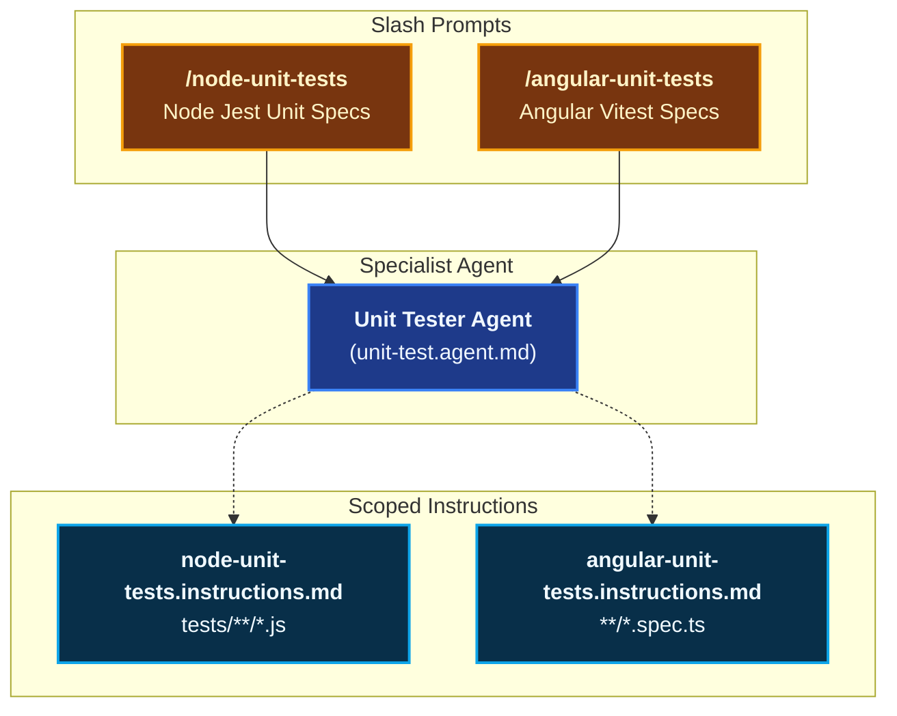
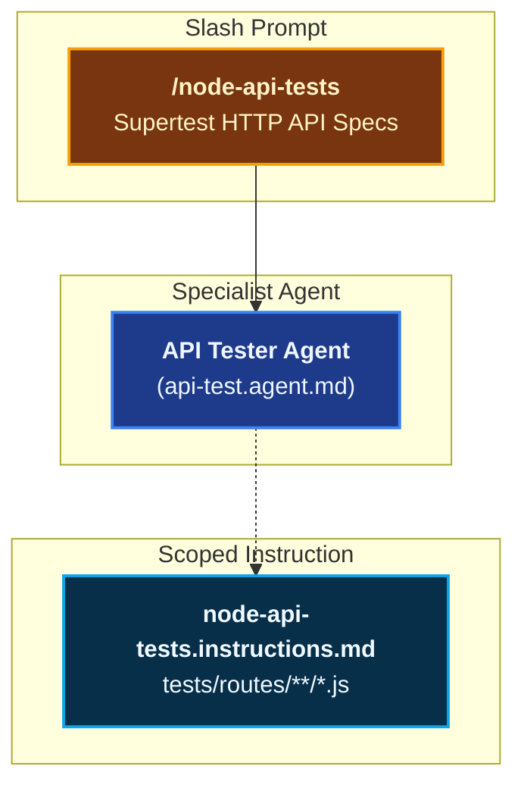
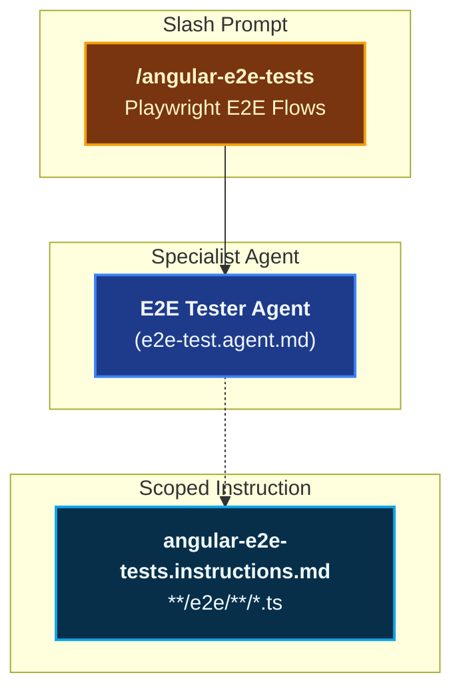
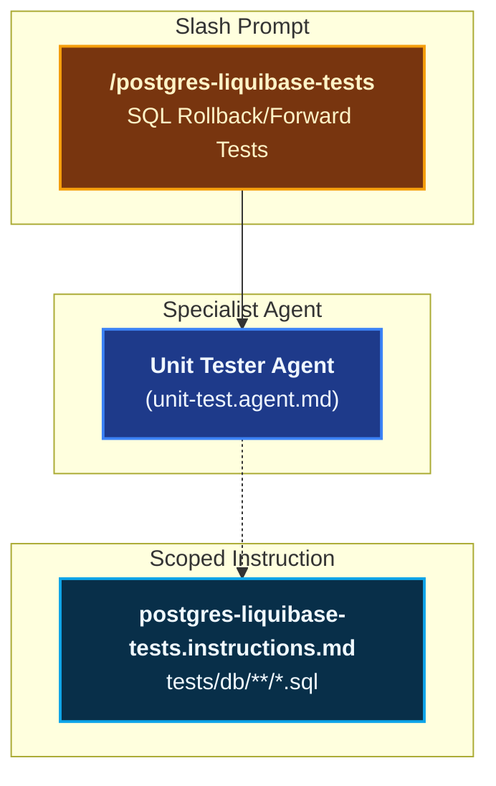
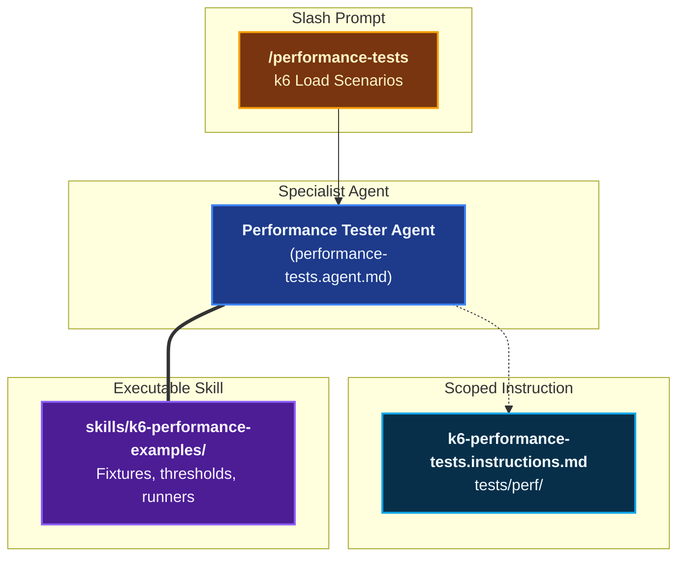
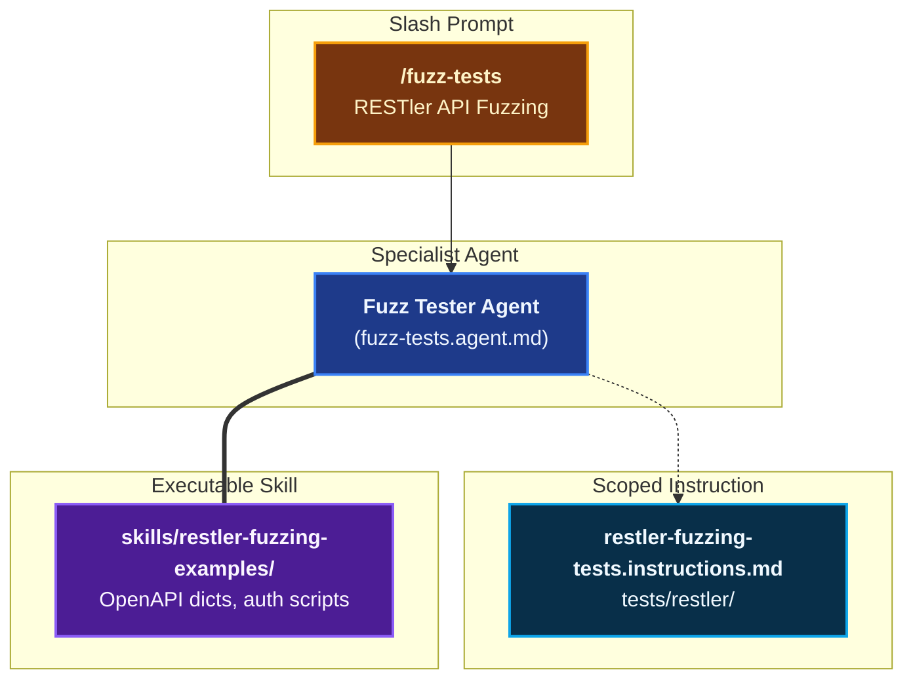

# Testing & Verification

The **Testing & Verification** domain provides end-to-end capabilities for authoring, isolating, and validating automated test suites across all application layers — from module unit tests and HTTP API integration to stateful API fuzzing.

Rather than authoring tests ad-hoc, Coding Pal enforces strict boundaries: **test agents are strictly scoped to one module or service, edit only test files, and must never alter production code without explicit user consent.**

---

## Domain Architecture

### 1. Unit & Component Testing

### 2. HTTP API Testing

### 3. End-to-End Testing

### 4. Database Testing

### 5. Performance & Load Testing

### 6. API Fuzz Testing

---

## Capabilities Matrix

| Capability | Slash Prompt | Specialist Agent | Scoping Instruction | Supporting Skill | Key Test Runner |
|---|---|---|---|---|---|
| **Node.js Unit Tests** | [`/node-unit-tests`](./catalog-prompts.md#1-node-unit-tests) | [`Unit Tester`](./catalog-agents.md#4-unit-tester) | [`node-unit-tests`](./catalog-instructions.md#3-node-unit-tests) | — | Jest |
| **Node.js HTTP API Tests** | [`/node-api-tests`](./catalog-prompts.md#2-node-api-tests) | [`API Tester`](./catalog-agents.md#5-api-tester) | [`node-api-tests`](./catalog-instructions.md#4-node-api-tests) | — | Supertest / Jest |
| **Angular Component Specs** | [`/angular-unit-tests`](./catalog-prompts.md#3-angular-unit-tests) | [`Unit Tester`](./catalog-agents.md#4-unit-tester) | [`angular-unit-tests`](./catalog-instructions.md#9-angular-unit-tests) | — | Vitest (`ng test`) |
| **Angular E2E Flows** | [`/angular-e2e-tests`](./catalog-prompts.md#4-angular-e2e-tests) | [`E2E Tester`](./catalog-agents.md#6-e2e-tester) | [`angular-e2e-tests`](./catalog-instructions.md#10-angular-e2e-tests) | — | Playwright |
| **PostgreSQL Migration Tests** | [`/postgres-liquibase-tests`](./catalog-prompts.md#5-postgres-liquibase-tests) | [`Unit Tester`](./catalog-agents.md#4-unit-tester) | [`postgres-liquibase-tests`](./catalog-instructions.md#6-postgresql-liquibase-tests) | — | SQL Assertions |
| **k6 Performance Tests** | [`/performance-tests`](./catalog-prompts.md#7-performance-tests) | [`Performance Tester`](./catalog-agents.md#8-performance-tester) | [`k6-performance-tests`](./catalog-instructions.md#12-k6-performance-tests) | [`k6-performance-examples`](./catalog-skills.md#8-k6-performance-examples) | k6 (Docker runner) |
| **RESTler API Fuzzing** | [`/fuzz-tests`](./catalog-prompts.md#8-fuzz-tests) | [`Fuzz Tester`](./catalog-agents.md#9-fuzz-tester) | [`restler-fuzzing-tests`](./catalog-instructions.md#13-restler-fuzzing-tests) | [`restler-fuzzing-examples`](./catalog-skills.md#9-restler-fuzzing-examples) | Microsoft RESTler |

---

## Capability Workflows

### 1. Node.js Module Unit Tests

- **Trigger**: `/node-unit-tests [src/path/to/module.js]`
- **Specialist Agent**: `Unit Tester` (`unit-test.agent.md`)
- **Scope & Isolation**: 
  - Resolves target module from chat input, editor cursor, or active tab.
  - Targets non-route units (`src/services/`, `src/utils/`, `src/middlewares/`, `src/controllers/` $\rightarrow$ Jest unit tests).
  - Target path: `src/<path>/<file>.js` → `tests/<path>/<file>.test.js`.
  - Mocks external collaborators (DB helpers, outbound HTTP, clocks).
- **Falsifiable Done When**:
  - All branching paths (happy path, edge values, null/undefined, error codes) are covered with explicit assertions.
  - Test suite passes via narrowest command (`npm test -- tests/<path>/<file>.test.js`).
  - **Zero production code files are modified.**

### 2. Node.js HTTP API Route Tests

- **Trigger**: `/node-api-tests [src/routes/resource.js]`
- **Specialist Agent**: `API Tester` (`api-test.agent.md`)
- **Scope & Isolation**:
  - Resolves target Express route module from chat input or active file.
  - Target path: `src/routes/<resource>.js` → `tests/routes/<resource>.test.js`.
  - Uses **Supertest** (`supertest(app)`) to drive HTTP requests (`GET`, `POST`, `PUT`, `PATCH`, `DELETE`) through the Express middleware pipeline.
  - Mocks database operations and external outbound HTTP clients at the boundary, without mocking route handlers or internal Express middleware.
- **Falsifiable Done When**:
  - Asserts HTTP status codes, JSON response body envelopes (`{ data }`, `{ error }`), and Content-Type headers.
  - Validates query routes (`POST /search`), mutations, validation failures (400), authentication/ACL denials (401/403), and missing resources (404).
  - Route test suite passes via narrowest command (`npm test -- tests/routes/<resource>.test.js`).
  - **Zero production code files are modified.**

### 3. Angular Vitest Component Specs

- **Trigger**: `/angular-unit-tests [src/app/path/to/component.ts]`
- **Scope & Isolation**:
  - Colocates `*.spec.ts` files adjacent to the implementation.
  - Enforces Vitest + `@testing-library/angular` or native TestBed patterns.
  - Mocks all injected dependencies (services, router, HTTP clients).
- **Falsifiable Done When**:
  - Spec executes cleanly with `ng test --include src/app/<path>/<name>.spec.ts`.
  - DOM event triggers and reactive signal state changes are validated.

### 4. Angular Playwright End-to-End Tests

- **Trigger**: `/angular-e2e-tests [flow-name]`
- **Specialist Agent**: `E2E Tester` (`e2e-test.agent.md`)
- **Scope & Isolation**:
  - Implements the Page Object Model (POM) pattern under `e2e/`.
  - Validates full browser interactions: authentication, forms, navigation guards, and accessibility selectors (`getByRole`, `getByText`).
  - Relies on running Docker dev stack and `baseURL`.
- **Falsifiable Done When**:
  - Playwright spec passes headlessly via `npx playwright test e2e/<flow>.spec.ts`.
  - **Zero production code files are modified.**

### 5. PostgreSQL & Liquibase Migration Assertions

- **Trigger**: `/postgres-liquibase-tests [db/changelog/path]`
- **Scope & Isolation**:
  - Generates deterministic SQL test scripts validating forward migrations, rollback integrity, and soft-delete triggers.
- **Automated Oracle**: Uses [`rollback-probe`](./catalog-skills.md#17-rollback-probe) to mechanically certify the full roundtrip lifecycle (`Forward` $\rightarrow$ `Rollback` $\rightarrow$ `Forward Re-apply`).
- **Falsifiable Done When**:
  - Migration applies cleanly to a temporary schema, verification assertions pass, and rollback returns the schema to pristine state (`rollback-probe.mjs` exits 0).

### 6. k6 Performance & Load Benchmarking

- **Trigger**: `/performance-tests [service-name]`
- **Agent**: [`Performance Tester`](./catalog-agents.md#8-performance-tester)
- **Scaffolding**: Employs [`k6-performance-examples`](./catalog-skills.md#8-k6-performance-examples) containing Docker Compose runners and threshold templates.
- **Falsifiable Done When**:
  - k6 scenario executes against the target endpoint asserting explicit SLA thresholds (e.g. `http_req_duration: ['p(95)<300']`, `http_req_failed: ['rate<0.01']`).
  - Outputs summary metrics in console and JSON formats.

### 7. RESTler API Grammar Fuzzing

- **Trigger**: `/fuzz-tests [openapi-path]`
- **Agent**: [`Fuzz Tester`](./catalog-agents.md#9-fuzz-tester)
- **Scaffolding**: Employs [`restler-fuzzing-examples`](./catalog-skills.md#9-restler-fuzzing-examples) containing compilation configurations, dictionary templates, and CI gating scripts.
- **Falsifiable Done When**:
  - RESTler compiles grammar from OpenAPI specs, fuzz-lean phase passes with 0 unexpected 500 server crashes.

### 8. Anti-Tautology Falsifiability Verification

- **Role**: Behavioral probe asserting tests are not vacuous or self-satisfying.
- **Skill Engine**: [`test-probe`](./catalog-skills.md#14-test-probe) (`skills/test-probe/scripts/test-probe.mjs`).
- **Mechanism**:
  - Asserts that modified code passes tests initially.
  - Temporarily reverts the source code under test to baseline HEAD.
  - Re-executes the test suite against the unpatched source: **fails if tests pass (tautology detection)**!
  - Restores modified source code atomically.
- **Done When**:
  - `test-probe.mjs` exits with code 0, proving the test suite genuinely fails without the fix.

---

## Related Schemas & Catalogs

- [Prompts Catalog](./catalog-prompts.md)
- [Agents Catalog](./catalog-agents.md)
- [Instructions Catalog](./catalog-instructions.md)
- [Skills Catalog](./catalog-skills.md)
- [Agent Markdown Schema](./schema-agents.md)
