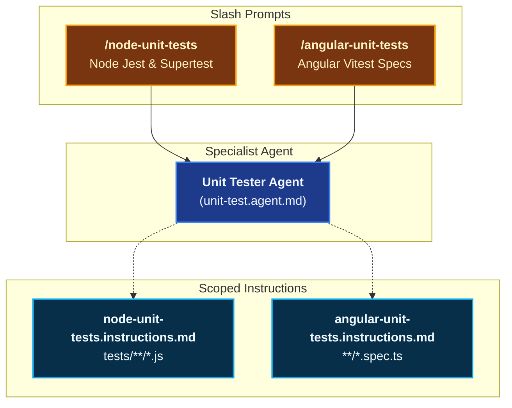
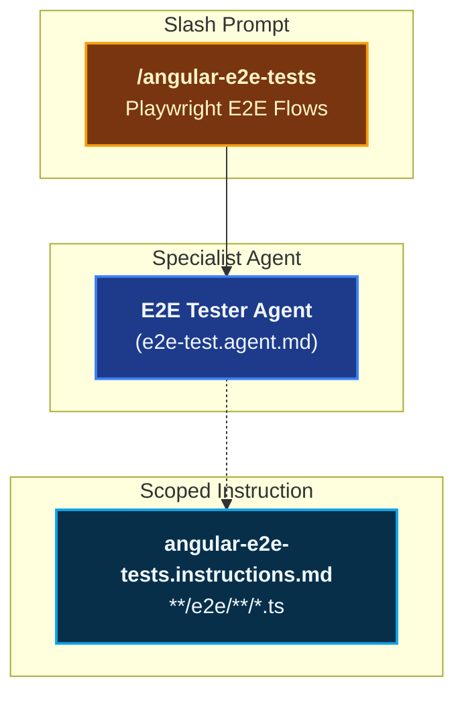
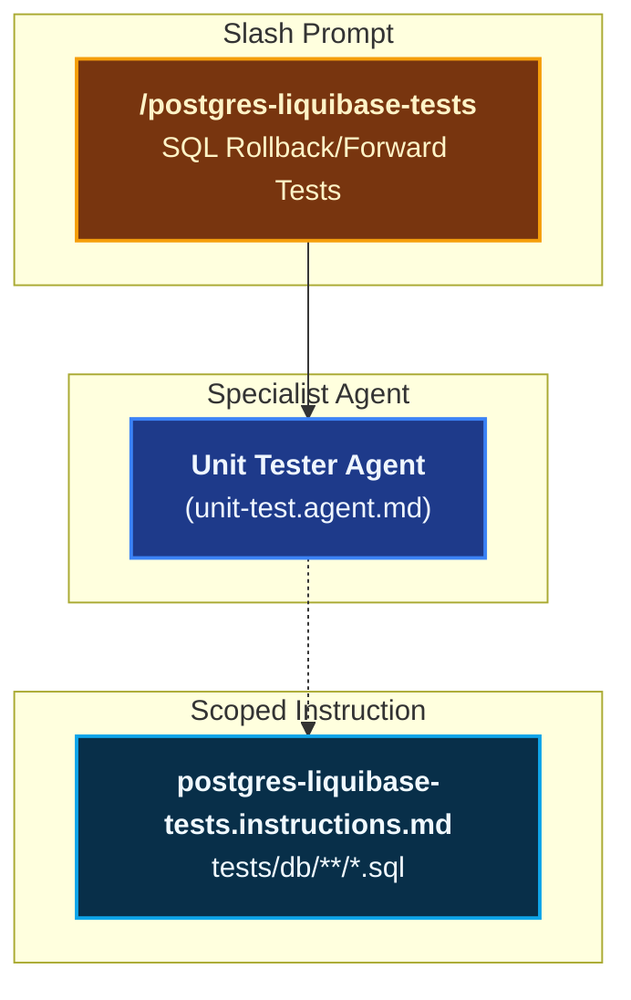
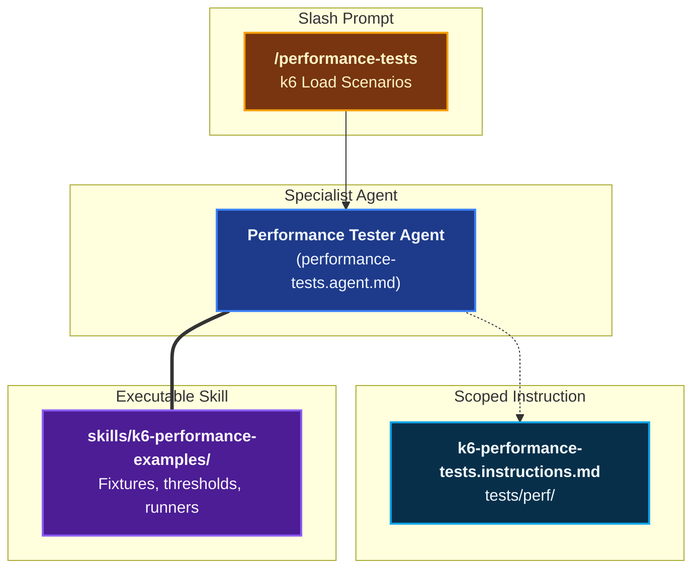
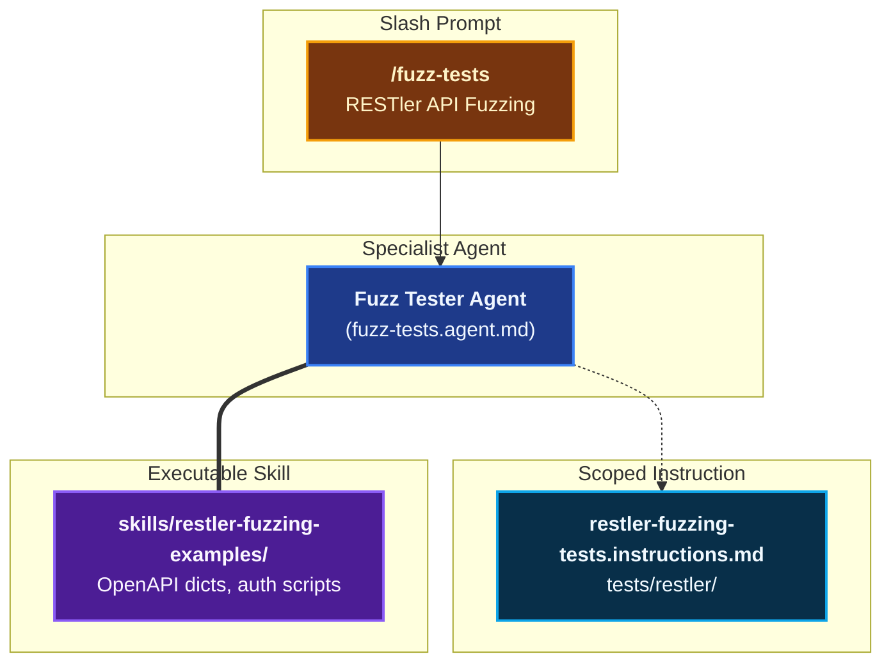

# Testing & Verification

The **Testing & Verification** domain provides end-to-end capabilities for authoring, isolating, and validating automated test suites across all application layers — from module unit tests to stateful API fuzzing.

Rather than authoring tests ad-hoc, Coding Pal enforces strict boundaries: **test agents are strictly scoped to one module or service, edit only test files, and must never alter production code without explicit user consent.**

---

## Domain Architecture

### 1. Unit & Component Testing

### 2. End-to-End Testing

### 3. Database Testing

### 4. Performance & Load Testing

### 5. API Fuzz Testing

---

## Capabilities Matrix

| Capability | Slash Prompt | Specialist Agent | Scoping Instruction | Supporting Skill | Key Test Runner |
|---|---|---|---|---|---|
| **Node.js Unit & API Tests** | [`/node-unit-tests`](./catalog-prompts.md#1-node-unit-tests) | [`Unit Tester`](./catalog-agents.md#4-unit-tester) | [`node-unit-tests`](./catalog-instructions.md#3-node-unit-tests) | — | Jest / Supertest |
| **Angular Component Specs** | [`/angular-unit-tests`](./catalog-prompts.md#2-angular-unit-tests) | [`Unit Tester`](./catalog-agents.md#4-unit-tester) | [`angular-unit-tests`](./catalog-instructions.md#8-angular-unit-tests) | — | Vitest (`ng test`) |
| **Angular E2E Flows** | [`/angular-e2e-tests`](./catalog-prompts.md#3-angular-e2e-tests) | [`E2E Tester`](./catalog-agents.md#5-e2e-tester) | [`angular-e2e-tests`](./catalog-instructions.md#9-angular-e2e-tests) | — | Playwright |
| **PostgreSQL Migration Tests** | [`/postgres-liquibase-tests`](./catalog-prompts.md#4-postgres-liquibase-tests) | [`Unit Tester`](./catalog-agents.md#4-unit-tester) | [`postgres-liquibase-tests`](./catalog-instructions.md#5-postgresql-liquibase-tests) | — | SQL Assertions |
| **k6 Performance Tests** | [`/performance-tests`](./catalog-prompts.md#6-performance-tests) | [`Performance Tester`](./catalog-agents.md#7-performance-tester) | [`k6-performance-tests`](./catalog-instructions.md#11-k6-performance-tests) | [`k6-performance-examples`](./catalog-skills.md#8-k6-performance-examples) | k6 (Docker runner) |
| **RESTler API Fuzzing** | [`/fuzz-tests`](./catalog-prompts.md#7-fuzz-tests) | [`Fuzz Tester`](./catalog-agents.md#8-fuzz-tester) | [`restler-fuzzing-tests`](./catalog-instructions.md#12-restler-fuzzing-tests) | [`restler-fuzzing-examples`](./catalog-skills.md#9-restler-fuzzing-examples) | Microsoft RESTler |

---

## Capability Workflows

### 1. Node.js Unit & Route Integration Tests

- **Trigger**: `/node-unit-tests [src/path/to/module.js]`
- **Scope & Isolation**: 
  - Resolves target module from chat input, editor cursor, or active tab.
  - Automatically discriminates between pure modules (`src/services/` → Jest unit tests) and HTTP routers (`src/routes/` → Supertest HTTP assertions).
  - Target path: `src/<path>/<file>.js` → `tests/<path>/<file>.test.js`.
- **Falsifiable Done When**:
  - All branching paths (happy path, edge values, null/undefined, error codes) are covered with explicit assertions.
  - Test suite passes via narrowest command (`npm test -- tests/<path>/<file>.test.js`).
  - **Zero production code files are modified.**

### 2. Angular Vitest Component Specs

- **Trigger**: `/angular-unit-tests [src/app/path/to/component.ts]`
- **Scope & Isolation**:
  - Colocates `*.spec.ts` files adjacent to the implementation.
  - Enforces Vitest + `@testing-library/angular` or native TestBed patterns.
  - Mocks all injected dependencies (services, router, HTTP clients).
- **Falsifiable Done When**:
  - Spec executes cleanly with `ng test --include src/app/<path>/<name>.spec.ts`.
  - DOM event triggers and reactive signal state changes are validated.

### 3. Angular Playwright End-to-End Tests

- **Trigger**: `/angular-e2e-tests [flow-name]`
- **Specialist Agent**: `E2E Tester` (`e2e-test.agent.md`)
- **Scope & Isolation**:
  - Implements the Page Object Model (POM) pattern under `e2e/`.
  - Validates full browser interactions: authentication, forms, navigation guards, and accessibility selectors (`getByRole`, `getByText`).
  - Relies on running Docker dev stack and `baseURL`.
- **Falsifiable Done When**:
  - Playwright spec passes headlessly via `npx playwright test e2e/<flow>.spec.ts`.
  - **Zero production code files are modified.**

### 4. PostgreSQL & Liquibase Migration Assertions

- **Trigger**: `/postgres-liquibase-tests [db/changelog/path]`
- **Scope & Isolation**:
  - Generates deterministic SQL test scripts validating forward migrations, rollback integrity, and soft-delete triggers.
- **Falsifiable Done When**:
  - Migration applies cleanly to a temporary schema, verification assertions pass, and rollback returns the schema to pristine state.

### 5. k6 Performance & Load Benchmarking

- **Trigger**: `/performance-tests [service-name]`
- **Agent**: [`Performance Tester`](./catalog-agents.md#6-performance-tester)
- **Scaffolding**: Employs [`k6-performance-examples`](./catalog-skills.md#8-k6-performance-examples) containing Docker Compose runners and threshold templates.
- **Falsifiable Done When**:
  - k6 scenario executes against the target endpoint asserting explicit SLA thresholds (e.g. `http_req_duration: ['p(95)<300']`, `http_req_failed: ['rate<0.01']`).
  - Outputs summary metrics in console and JSON formats.

### 6. RESTler API Grammar Fuzzing

- **Trigger**: `/fuzz-tests [openapi-path]`
- **Agent**: [`Fuzz Tester`](./catalog-agents.md#7-fuzz-tester)
- **Scaffolding**: Employs [`restler-fuzzing-examples`](./catalog-skills.md#9-restler-fuzzing-examples) containing compilation configurations, dictionary templates, and CI gating scripts.
- **Falsifiable Done When**:
  - RESTler compiles grammar from OpenAPI specs, fuzz-lean phase passes with 0 unexpected 500 server crashes.

---

## Related Schemas & Catalogs

- [Prompts Catalog](./catalog-prompts.md)
- [Agents Catalog](./catalog-agents.md)
- [Instructions Catalog](./catalog-instructions.md)
- [Skills Catalog](./catalog-skills.md)
- [Agent Markdown Schema](./schema-agents.md)
