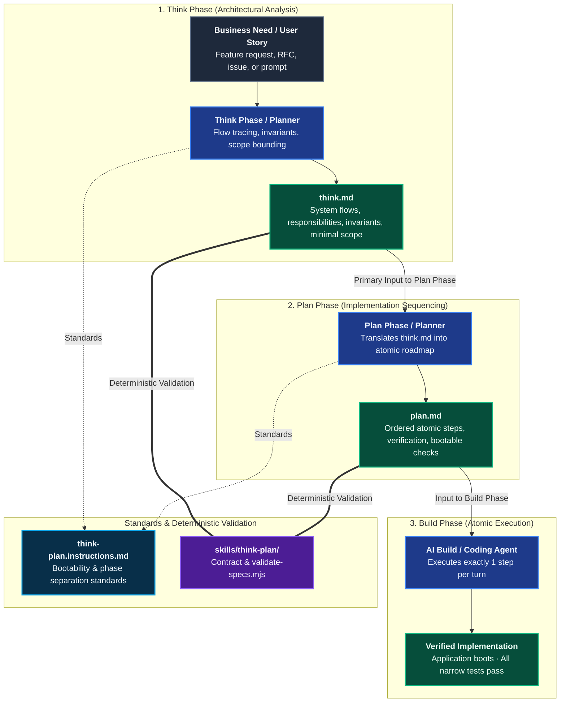
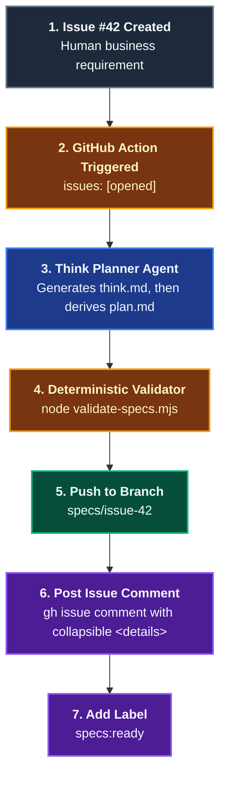

# Think & Plan

The **Think & Plan** domain provides an automated, agentic specification methodology that translates unstructured business needs and user stories into persistent, machine-consumable artifacts (`think.md` and `plan.md`).

Rather than writing narrative PRDs that overwhelm AI agent context and compound errors, Coding Pal enforces a strict two-stage pipeline: **Think** (grounding architecture, tracing flows, mapping components, and bounding minimal scope) followed by **Plan** (sequencing atomic steps with narrow verification commands and explicit bootability checks). Downstream build agents consume these persistent artifacts step-by-step with zero hallucinated scope.

---

## Domain Architecture



---

## Capabilities Matrix

| Capability | Invocation / Entry Point | Specialist Agent | Scoping Instruction | Supporting Skill | Output Artifact |
|---|---|---|---|---|---|
| **Business Needs to Specifications** | Planning session or [`Think Planner`](./catalog-agents.md#9-think-planner) agent (CI) | [`Think Planner`](./catalog-agents.md#9-think-planner) | [`think-plan`](./catalog-instructions.md#think--plan-instructions) | [`think-plan`](./catalog-skills.md#10-think-plan) | `specs/think.md` and `specs/plan.md` (System flows, invariants, atomic checklist, bootability checks) |

---

## Capability Workflows

### 1. Business Needs to Specifications: Think & Plan

- **When to Run**: Before authoring code for any non-trivial business need, user story, feature request, or architectural change. Can be run interactively in the IDE (planning session) or headlessly in CI/CD when a GitHub issue is opened.
- **Why It Replaces Traditional Specs**:
  - Traditional PRDs and narrative design docs are verbose, full of unstated assumptions, and swamp the LLM context window with conversational prose.
  - In an agentic operating model, specifications are actionable data structures for models:
    1. `think.md` grounds the LLM in real codebase architecture, data flows, invariants, and bounds the minimal change footprint.
    2. `plan.md` sequences the implementation into atomic, dependency-ordered steps where each step verifies local functionality and asserts the application remains bootable.
  - Downstream build agents consume `plan.md` one step at a time in fresh context sessions, preventing error compounding.
- **Workflow Steps**:
  1. **Phase 1: Think**:
     - *Interactive (IDE)*: Open a planning or reasoning session with your AI assistant and prompt with the business requirement: *"Analyze the business need for [feature] and save findings to specs/think.md."*
     - *Headless (GitHub Action)*: Triggered on `issues: [opened]`, invoking the **Think Planner** agent (`think-plan.agent.md`) with the issue title and body.
     - The `think-plan.instructions.md` standard automatically loads, ensuring the model traces existing flows, maps component responsibilities, respects invariants, and confines scope without writing code.
     - Emits `specs/think.md` conforming to [`skills/think-plan/references/think-plan-contract.md`](./catalog-skills.md#10-think-plan).
  2. **Phase 2: Plan**:
     - *Interactive (IDE)*: In a clean planning session: *"From specs/think.md, generate specs/plan.md."*
     - *Headless (CI)*: The **Think Planner** agent automatically synthesizes `specs/plan.md` directly from the validated `think.md`.
     - Emits `specs/plan.md` containing atomic steps with explicit `Files:`, `Action:`, `Verification:`, and `Bootable Check:`.
  3. **Phase 3: Automated Validation**:
     - Specs are deterministically validated via the skill validator:
       ```bash
       node .agents/skills/think-plan/scripts/validate-specs.mjs --dir specs
       ```
  4. **Phase 4: Agentic Build**:
     - Launch an AI build or coding agent with clean context.
     - Prompt: *"From specs/plan.md, implement Step 1 only."*
     - The agent executes one verified step at a time, keeping the application bootable throughout.

#### Downstream Execution Discipline

When an AI build agent implements functionality from `plan.md`:
1. It reads `plan.md` in a fresh chat session (clean context).
2. It executes **exactly one step** from the checklist.
3. It runs the step's `Verification` command and asserts that the application still boots (`Bootable Check`).
4. Only when both pass does it mark the step done and proceed to the next step in a clean session.

#### Storage & GitHub Issue Attachment Pattern

When automating specifications from GitHub issues in CI/CD, specifications follow the **Issue Comment + Dedicated Branch** pattern:



1. **Non-destructive Issue Comment**: The action **never overwrites** the issue description. Leaving the human product owner's original words intact preserves the authentic requirement while keeping discussions and reviews threaded.
2. **Collapsible Visual Layout**: Full specifications are posted in a comment formatted with HTML `<details>` tags:
   - `think.md` enclosed in `<details><summary>🧠 <b>think.md (System Flow & Invariants)</b></summary> ... </details>`.
   - `plan.md` enclosed in `<details open><summary>📝 <b>plan.md (Implementation Steps)</b></summary> ... </details>`.
3. **Dedicated Branch Storage**: Files are committed to `specs/issue-<number>/` on branch `specs/issue-<number>`, providing clean filesystem access for downstream build agents.

- **Falsifiable Done When**:
  - `think.md` and `plan.md` pass `skills/think-plan/scripts/validate-specs.mjs` with exit code 0.
  - Zero code was modified during specification generation.

---

## Related Catalogs & Schemas

- [Prompts Catalog](./catalog-prompts.md)
- [Agents Catalog](./catalog-agents.md)
- [Instructions Catalog](./catalog-instructions.md)
- [Skills Catalog](./catalog-skills.md)
- [Persistent Context Architecture](./persistent-context.md)
- [Specs & Docs Domain](./domain-docs.md)
