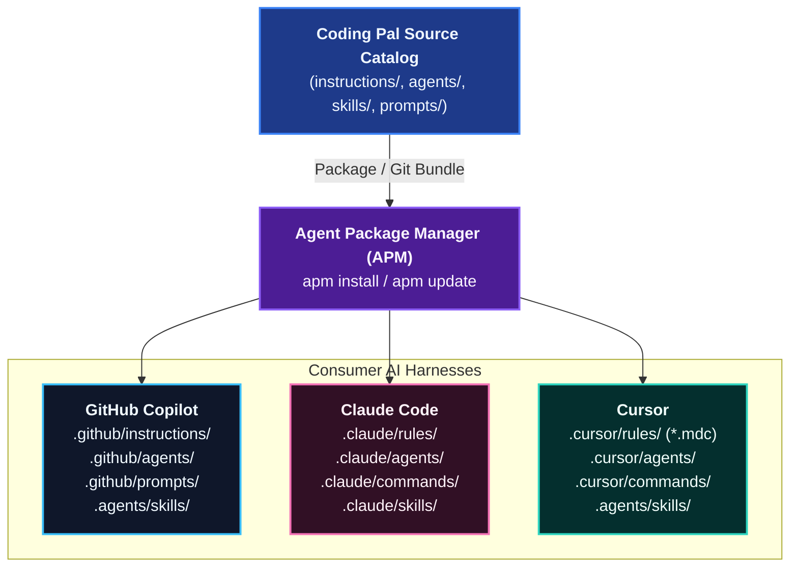

# Overview

**Coding Pal** is a centralized, version-controlled catalog of persistent context primitives designed to elevate AI coding assistants (GitHub Copilot, Claude Code, and Cursor) across engineering teams.

Maintained by **ALTEN Group**, Coding Pal solves the common failure modes of AI code assistants: hallucinated conventions, bloated token context, prompt drift, inconsistent architectural patterns, and unbounded agent behavior.

## Key Capabilities

- **Persistent Context Standardization** — Defines engineering rules, conventions, and architectural boundaries in machine-readable markdown files that persist across sessions.
- **Universal Multi-Harness Deployment** — Authors guidance once in standard Markdown/YAML, and distributes automatically to GitHub Copilot, Claude Code, and Cursor using [APM (Agent Package Manager)](https://microsoft.github.io/apm/).
- **Sharp Agent Philosophy** — Prevents overengineering, token waste, and hallucination through tightly scoped agents with strict boundaries and falsifiable completion criteria.
- **The Golden Split** — Separates task scope, universal coding rules, and machine-validated contracts into discrete, non-overlapping primitives.
- **Scaffolding and Validation Skills** — Bundles executable scripts, verification fixtures, and reusable templates alongside normative specifications.
## The Problem Solved

Without a versioned persistent context catalog:

1. **Hallucinated Standards**: Each developer re-explains company conventions (naming, layering, error codes, database migration practices) in every chat prompt.
2. **Context Window Waste**: Dumping generic, repetitive guidelines into global system prompts rapidly depletes the model's context window.
3. **Prompt Drift**: Teams diverge in coding standards because instructions live in local scratchpads or individual chat histories.
4. **Unbounded Agent Modification**: AI agents frequently introduce unrequested dependencies, modify production code when only tests were requested, or declare success prematurely without running tests.

Coding Pal eliminates these issues by codifying standards into 4 well-defined primitives: **Instructions**, **Agents**, **Skills**, and **Prompts**.

## Next Steps

- Understand the [Persistent Context Architecture](./persistent-context.md).
- Browse the full [Catalog Reference](./catalog-prompts.md).
- Examine the exact [Prompt Markdown Schema](./schema-prompts.md) and [Agent Markdown Schema](./schema-agents.md).

