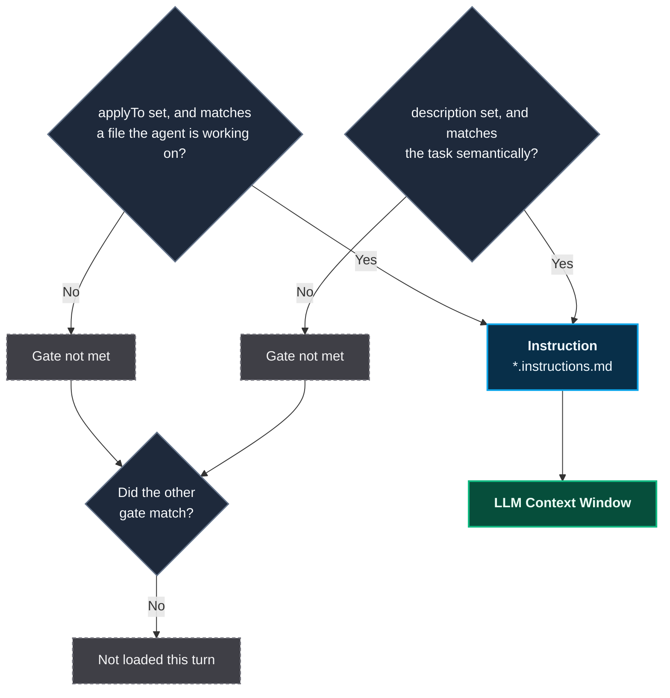
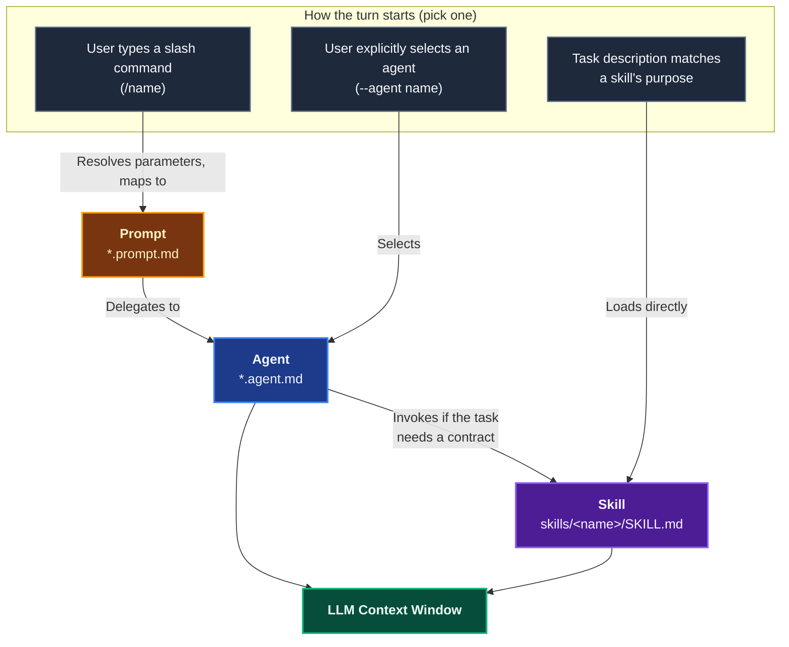
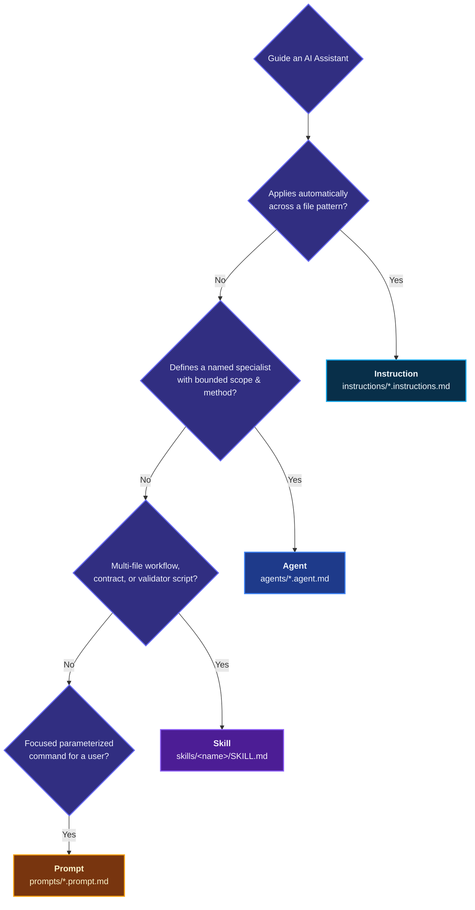
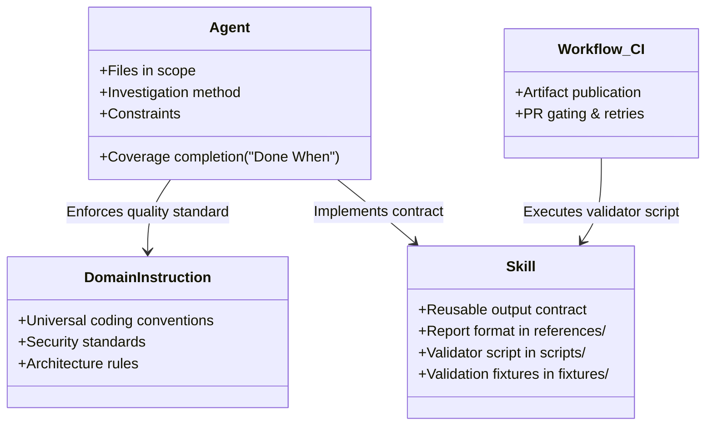

# Persistent Context Architecture

Persistent Context represents the collection of rules, schemas, specialized personas, and procedural workflows that remain available to an AI coding assistant across development cycles.

Instead of relying on volatile chat memory or giant prompt dumps, Coding Pal organizes persistent context into four distinct primitives, loaded dynamically according to context and user action.

## Context Lifecycle: Always-On vs On-Demand

Two rules govern how primitives reach the context window:

1. **An instruction file has two independent activation gates, and either one is enough to load it.** `applyTo` matches against a file the agent is working on this turn; `description` matches semantically against the task itself, with no file required at all. Neither gate needs a prompt, agent, or skill to request it — the check runs automatically in the background. If an instruction has neither an `applyTo` match this turn nor a `description` relevant to the task, it does not load. Where a match does happen (either gate), that instruction simply stacks underneath whichever prompt, agent, or skill also fires — it is never an alternative to them.
2. **Prompts, Agents, and Skills are three separate on-demand entry points.** Only one of them starts a given turn (a slash command, an explicit agent invocation, or a semantic skill match) — but a prompt or an agent can pull in a skill downstream of that entry point.

### The Always-On Layer



This is the verified mechanism per VS Code's documentation: "the agent determines which instructions files to apply based on the file patterns specified in the `applyTo` property… or semantic matching of the instruction description to the current task." An instruction with neither property set is never applied automatically; it can still be attached manually to a chat request.

### The Three On-Demand Entry Points

Each entry point below is a separate way a turn can **start**. Pick the row that matches how the user acted; the instruction layer above still applies on top of all three.



Three things to read off this diagram:
- A **prompt** never reaches the context window directly — it always hands off to the agent it maps to.
- An **agent** (whether reached via a prompt or invoked directly) may pull in a **skill** if the task requires a reusable contract or validator.
- A **skill** can also be reached with no agent involved at all, when the task description alone matches it.

| Primitive | Loading Model | Trigger Condition | Primary Purpose |
|---|---|---|---|
| **Instruction** | **Always-on** | Active file matches `applyTo` glob pattern | Stable rules, conventions, security guidelines, and architectural standards |
| **Agent** | **On-demand** | Explicitly selected (e.g. `--agent <name>`) | Scoped specialist with bounded method, strict constraints, and completion criteria |
| **Skill** | **On-demand** | Semantic task match or explicitly loaded by agent/user | Multi-file procedures, contracts, executable validation scripts, and templates |
| **Prompt** | **On-demand** | Explicitly invoked via slash command (`/<name>`) | Parameterized entry point mapping user intent to agents and instructions |

## The Decision Tree

When adding persistent guidance, start from the desired operational behavior rather than file format:



```
Do you need to guide an AI assistant?
│
├── 1. Does the guidance apply to most code changes matching a file pattern?
│   └── YES ➔ Create an INSTRUCTION (instructions/*.instructions.md)
│
├── 2. Does it define a named specialist with bounded scope, method, and rules?
│   └── YES ➔ Create an AGENT (agents/*.agent.md)
│
├── 3. Does it provide a multi-file workflow, contract, validator script, or templates?
│   └── YES ➔ Create a SKILL (skills/<name>/SKILL.md)
│
└── 4. Is it a focused, parameterized single command for a user?
    └── YES ➔ Create a PROMPT (prompts/*.prompt.md)
```

> [!TIP]
> If a single capability seems to span multiple answers, **split responsibilities**. Do not create a single file that attempts to act as an agent, define general coding standards, and dictate machine-readable report contracts all at once.

## Ownership Rules

A core tenet of Coding Pal is **Single Authoritative Ownership**:
- Every rule or convention belongs to exactly one file.
- Other primitives link to or invoke the owner; they do not restate, duplicate, or override the owner.

### 1. Instructions Own Standards
Durable, file-oriented standards live in `instructions/*.instructions.md`.
- Enforces conventions like error handling, SQL patterns, Docker container layering, or UI component structure.
- Injected automatically only when relevant files are in context via `applyTo`.
- Keeps instructions short and imperative. Scaffolding templates and long code samples belong in a paired skill under `skills/<name>-examples/`.

### 2. Agents Own Task Scope and Method
Specialist personas live in `agents/*.agent.md`.
- Answers: What work is in scope? Which layers are touched? What constraints apply? How is the task verified?
- Agents conduct work; they do not own report formats, schemas, or universal coding rules.

### 3. Skills Own Workflows, Contracts, and Validation
Complex, multi-step procedures live in `skills/<skill-name>/`.
- Always a directory containing `SKILL.md` plus optional `references/`, `scripts/`, `fixtures/`, and `templates/`.
- Owns machine-readable contracts and deterministic validation scripts.

### 4. Prompts Own Single Parameterized Operations
Slash commands live in `prompts/*.prompt.md`.
- Maps user inputs, selections, and active paths to a specific agent and its guiding instructions.
- Parameter resolution pipeline with clear precedence.

---

## The Golden Split

When an agent executes a workflow that produces a structured artifact (e.g., Code Audit producing an audit report, or Spec from Code producing technical specifications), responsibilities are split strictly according to the **Golden Split**:



| Concern | Authoritative Owner | Example in Coding Pal |
|---|---|---|
| Target files and systems to examine | **Agent** | `code-audit.agent.md` defines which modules are in scope |
| Method of investigation or repair | **Agent** | `audit-fix.agent.md` defines surgical one-finding repair |
| Domain coding standards & security rules | **Instruction** | `node-express.instructions.md`, `docker.instructions.md` |
| Reusable output schema and format | **Skill** (`references/`) | `skills/audit-reporting/references/contract.md` |
| Deterministic artifact validation | **Skill** (`scripts/`) | `skills/audit-reporting/scripts/validate.js` |
| Task coverage completion | **Agent** (`Done When`) | "Every file in scope has been examined" |
| Artifact validity completion | **Skill** (`Done When`) | "Report satisfies the validation contract" |
| CI publication, gating, and PR checks | **Consuming Workflow** | GitHub Actions workflow in consumer repo |

> [!IMPORTANT]
> An agent must say *"Follow the installed `audit-reporting` skill"*. It must **not** duplicate report headings, field names, or validation rules in its own body. Model compliance alone is not enforcement — workflows must run the deterministic skill script.
